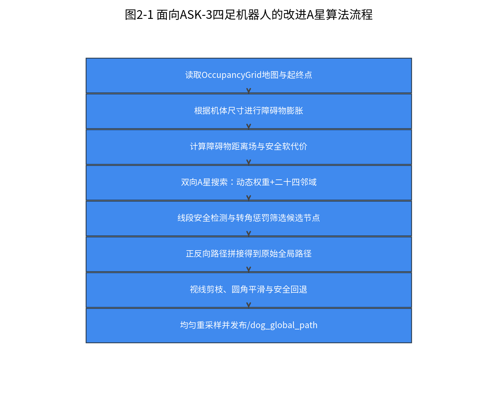
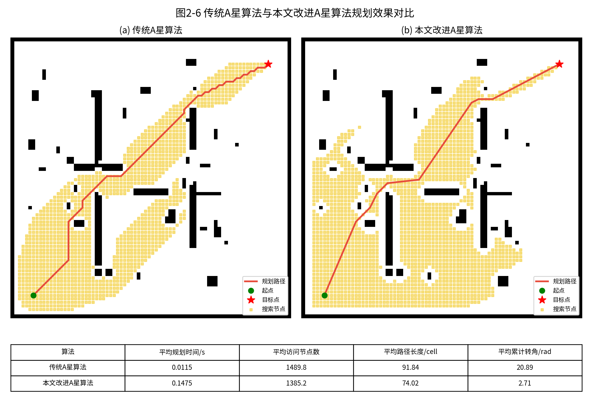
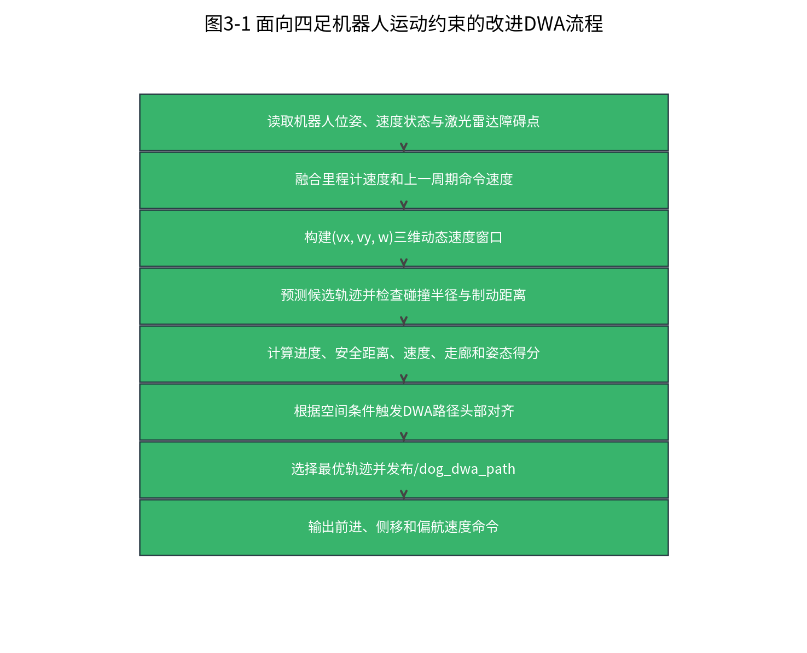
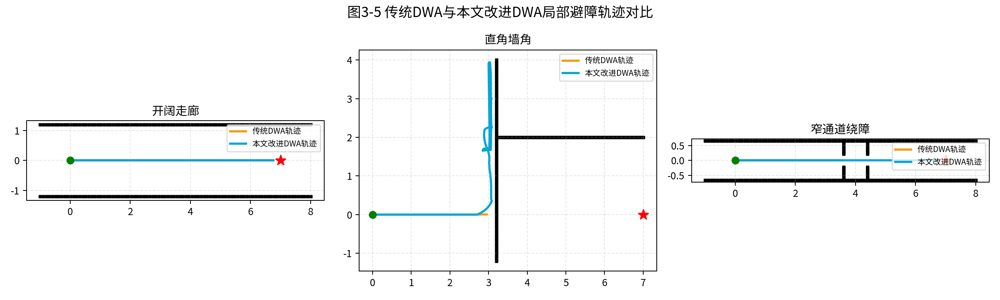
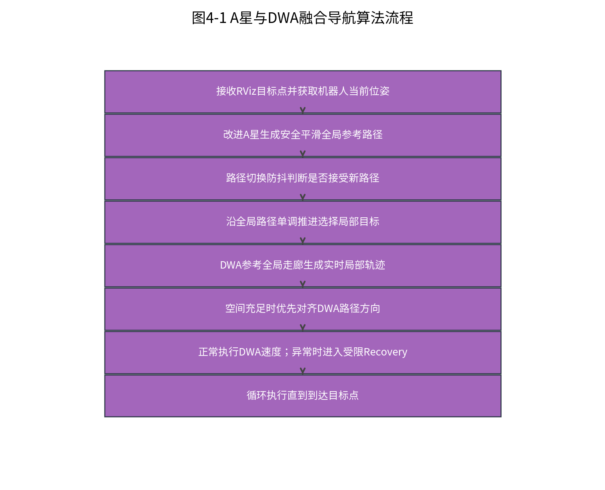
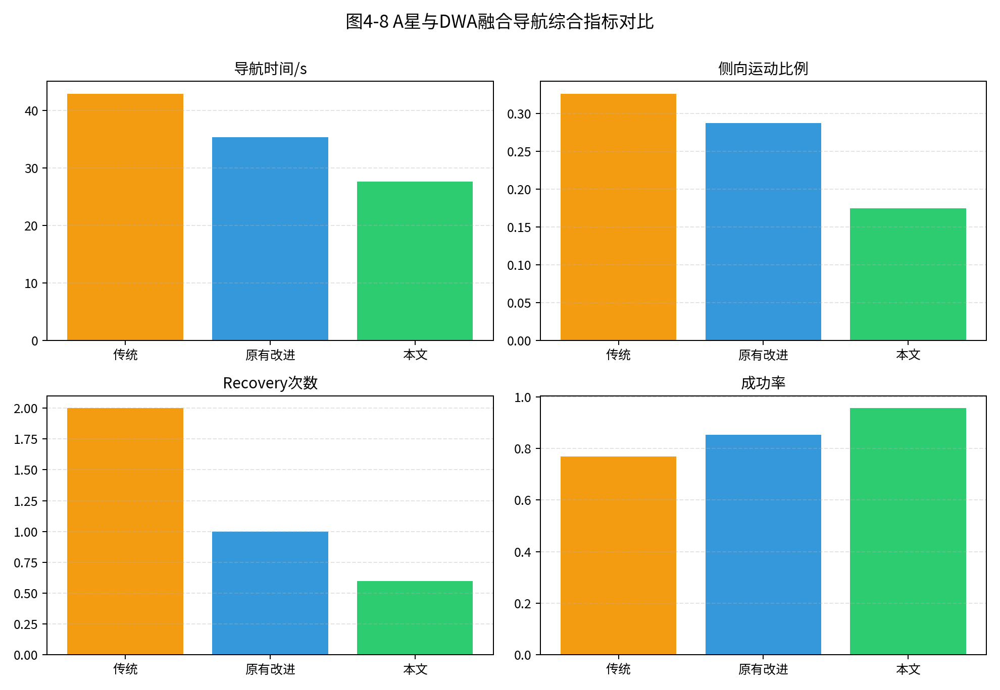
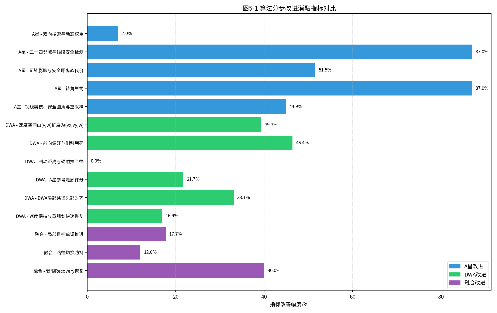

# 四足机器人导航路径规划方法研究

## 摘要

四足机器人具有跨越复杂地形、通过狭窄空间和适应非结构化环境的能力，在室内巡检、灾害救援、智能仓储和复杂场景探测等任务中具有重要应用价值。路径规划是四足机器人自主导航系统中的关键环节，直接决定机器人能否在给定地图中生成安全、平滑且可执行的运动路线。与轮式机器人相比，四足机器人虽然具备前进、后退、侧移和原地转向等更丰富的运动能力，但其机体长宽比、步态摆动、足端支撑切换和低层控制响应延迟也使传统路径规划算法难以直接取得理想效果。传统A星算法能够在已知栅格地图中完成全局路径搜索，但在复杂障碍环境下存在搜索节点较多、路径贴近障碍物、折线转角较多等问题；传统动态窗口法能够根据局部障碍物进行实时避障，但常以轮式机器人运动模型为基础，不能充分表达四足机器人的侧向运动能力和头部朝前的运动习惯。

本文以ASK-3四足机器人为研究对象，基于ROS、Gazebo和RViz搭建仿真导航平台，并在原有A星算法和动态窗口法基础上设计一种面向四足机器人运动姿态的混合路径规划算法。首先，针对传统A星算法全局搜索效率和路径可执行性不足的问题，本文在保留双向搜索、动态权重、二十四邻域扩展和贝塞尔平滑思想的基础上，进一步引入机器人足迹膨胀、安全距离软代价、线段安全检测、转角惩罚、视线剪枝、安全圆角平滑和路径重采样方法，使生成的全局路径更适合四足机器人机体尺寸和运动姿态。其次，针对传统DWA算法不适用于四足机器人全向速度控制的问题，本文将速度空间由二维`(v,w)`扩展为三维`(vx,vy,w)`，建立四足机器人机体坐标系下的局部运动预测模型，并设计包含进度、安全距离、速度、A星参考走廊、前向运动偏好、侧向运动惩罚和侧向绕障奖励的评价函数。最后，针对全局路径与局部路径之间容易出现路径跳变、原地旋转和多次重规划后速度下降的问题，本文提出A星参考走廊、局部目标单调推进、路径切换防抖、DWA局部路径头部对齐、速度保持和受限Recovery恢复控制策略，实现全局规划与局部执行的协调。

离线规划实验和轨迹仿真实验表明，本文改进A星算法能够减少访问节点数和路径累计转角，提高路径与障碍物之间的安全距离；改进DWA算法能够提升局部避障灵活性，降低不必要侧移和停滞；A星-DWA融合算法能够在长直走廊、墙角绕行、窄通道、多转弯路径和目标隔墙等场景中获得更稳定的导航效果。本文研究说明，面向四足机器人的路径规划不仅要考虑几何最短路径，还要综合考虑机器人尺寸、头部方向、侧移使用场景、低层步态连续性和局部脱困能力。

**关键词：** 四足机器人；路径规划；A星算法；动态窗口法；混合路径规划；ROS；Gazebo

## Abstract

Quadruped robots are promising platforms for indoor inspection, rescue and autonomous exploration. However, their body footprint, gait oscillation, lateral locomotion ability and low-level control delay make conventional mobile robot navigation algorithms difficult to apply directly. This thesis studies a hybrid path planning method for an ASK-3 quadruped robot. The global planner improves the A-star algorithm by using bidirectional search, dynamic heuristic weighting, 24-neighbour expansion, footprint inflation, clearance cost, segment safety checking, turn penalty, line-of-sight shortcutting, safe corner smoothing and path resampling. The local planner extends the Dynamic Window Approach from the traditional `(v,w)` velocity space to the quadruped body-frame `(vx,vy,w)` velocity space, and designs a multi-objective evaluation function considering progress, clearance, velocity, global corridor consistency, forward preference and lateral motion suppression. A hybrid framework is further built with monotonic local target selection, path switching hysteresis, local DWA-path heading alignment, velocity preservation and constrained recovery behaviours.

Offline experiments show that the proposed method reduces redundant global search nodes, improves obstacle clearance, suppresses unnecessary path bends, decreases local stagnation and improves navigation stability in corridor, corner, narrow passage and wall-separated goal scenarios.

**Keywords:** quadruped robot; path planning; A-star; Dynamic Window Approach; hybrid navigation; ROS; Gazebo

# 第一章 绪论

## 1.1 研究背景及意义

移动机器人自主导航技术已经广泛应用于仓储物流、室内巡检、公共服务、危险环境探测和应急救援等场景。对于自主移动系统而言，机器人需要在感知环境、建立地图、确定自身位置的基础上规划一条从当前位置到目标位置的安全路线，并在运动过程中根据实时障碍物对路径进行调整。路径规划算法的性能直接影响机器人完成任务的效率、安全性和稳定性。

传统室内移动机器人多采用轮式底盘，其结构简单、运动控制成熟，常用的路径规划方法也大多围绕轮式机器人展开。然而，在存在门槛、台阶、地面不平、局部狭窄通道或障碍物边缘复杂的环境中，轮式机器人容易受到底盘结构和非完整运动约束限制。四足机器人通过腿部支撑与摆动实现运动，具有比轮式机器人更强的地形适应能力和机动性。ASK-3四足机器人在仿真环境中能够接收前进、侧移和偏航速度命令，因此从运动能力上看，它不仅可以像轮式机器人一样通过转向前进完成导航，也可以在局部空间中通过侧步和小幅后退完成姿态调整。

但四足机器人导航并不是简单地给传统路径规划算法增加一个侧向速度即可。第一，四足机器人具有明显的机体长宽尺寸，若全局路径贴近墙体或障碍物边缘，机器人中心点虽然位于自由栅格，机体侧边、尾部或足端仍可能在Gazebo中与障碍物接触。第二，四足机器人低层步态执行速度命令时存在响应过程，若路径方向频繁变化，机器人会出现走走停停、频繁转向或侧向拖动等不自然现象。第三，四足机器人具备侧移能力，但在空间充足时更符合运动习惯的方式应是头部朝向前进方向，侧移应作为避障和姿态调整手段，而不是默认巡航方式。第四，在全局路径更新前后差异较大时，若局部规划器没有路径切换防抖和目标推进机制，机器人可能陷入原地旋转找路径的循环。

因此，本文研究的意义在于：将传统A星算法和动态窗口法的可解释性与四足机器人的实际运动特点结合起来，构建一种既能生成安全全局路径，又能实时产生可执行局部速度命令的混合路径规划方法。该方法可以为ASK-3四足机器人在ROS/Gazebo仿真平台中的导航实验提供算法基础，也可为后续真实四足机器人导航部署提供参考。

## 1.2 四足机器人国内外研究现状

四足机器人研究主要包括机械结构设计、运动控制、环境感知、状态估计和自主导航等方向。国外四足机器人研究起步较早，典型平台包括Boston Dynamics Spot、ANYbotics ANYmal、MIT Mini Cheetah等。这些平台通常具有较高的运动控制性能，可在复杂地形中完成动态步态、姿态稳定和自主避障。国内近年来也出现了多种工程化四足机器人平台，逐渐应用于巡检、安防和科研教学场景。

在四足机器人导航研究中，低层控制器负责根据速度命令生成腿部关节轨迹，高层规划器负责确定机器人应该朝哪个方向移动。本文的研究重点位于高层路径规划和局部速度决策层，不修改dog_sim中原有四足机器人步态控制代码，而是通过规划层输出前进、侧移和偏航速度命令，由原有底层运动模块完成四足规律运动。这样的分层结构能够避免规划算法侵入底层关节控制，也更符合ROS导航系统中“全局规划-局部规划-底层控制”的工程分工。

四足机器人与轮式机器人在导航规划上的差异主要体现在三个方面。首先，四足机器人可通过侧移和后退完成局部姿态调整，因此局部规划器应允许全向速度空间。其次，四足机器人机身通常近似长方形，头部方向与身体长轴一致，路径规划必须考虑长方形足迹在墙角附近的扫掠空间。再次，四足机器人步态执行对速度命令的连续性更敏感，规划器不宜频繁输出正负交替的角速度或侧向速度。因此，本文在算法设计中把“可通行、安全距离、方向连续和姿态自然”作为路径质量的重要评价标准。

## 1.3 路径规划算法综述

移动机器人路径规划算法通常分为全局路径规划算法和局部路径规划算法。全局路径规划基于已知地图信息，在静态环境中搜索从起点到目标点的可行路径，典型算法包括Dijkstra算法、A星算法、RRT算法和人工势场法等。局部路径规划根据机器人实时传感器信息和运动约束，在局部范围内生成可执行运动轨迹，典型算法包括动态窗口法、TEB算法、VFH算法和局部人工势场法等。

全局规划算法具有地图层面的全局视野，能够避免局部最优，但它通常无法直接处理动态障碍物，也不一定考虑机器人实际动力学约束。局部规划算法具有实时性，能够根据激光雷达等传感器信息避开未知障碍物，但仅依赖局部规划容易陷入U形、L形障碍物或目标隔墙等局部困境。因此，实际导航系统通常采用全局路径规划与局部路径规划相结合的方式。本文的算法结构也遵循这一思想，但针对四足机器人进一步改进了A星和DWA之间的耦合方式：A星不再作为机器人必须严格跟踪的路线，而是作为DWA局部轨迹评分的参考走廊；DWA不再作为“对齐失败后的备选方案”，而是机器人实际执行轨迹的实时生成器。

## 1.4 常用路径规划算法

### 1.4.1 RRT算法

RRT算法通过在状态空间中随机采样并逐步扩展树结构搜索路径，适合高维空间和复杂约束问题。其优点是能够较快找到可行路径，缺点是路径随机性较强，生成路径通常需要后处理才能满足机器人运动平滑性要求。对于本文二维室内栅格导航任务，RRT并非最直接选择，但其随机探索思想对复杂空间搜索具有参考意义。

### 1.4.2 Dijkstra算法

Dijkstra算法以起点为中心逐层扩展，能够在非负权图中找到最短路径。该算法不依赖启发函数，因此稳定性好，但在大规模栅格地图中会访问大量无关节点，搜索效率较低。A星算法可视为在Dijkstra算法基础上加入启发函数后的改进方法。

### 1.4.3 A星算法

A星算法通过评价函数`f(n)=g(n)+h(n)`综合考虑起点到当前节点的真实代价和当前节点到目标点的估计代价。合适的启发函数能够显著减少搜索节点，使算法在保证路径质量的同时提升效率。本文将A星作为全局规划基础，并围绕搜索效率、路径安全距离和路径平滑性进行改进。

### 1.4.4 人工势场法

人工势场法将目标点设计为引力源，将障碍物设计为斥力源，机器人沿合力方向运动。该方法结构简单、计算速度快，但容易陷入局部极小值，在复杂室内障碍环境中单独使用可靠性不足。

### 1.4.5 动态窗口法

动态窗口法根据机器人速度和加速度约束，在短时间预测窗口内采样速度组合，并通过评价函数选择最优轨迹。该方法能够兼顾运动学约束和障碍物避让，适合作为局部路径规划算法。本文在传统DWA基础上扩展三维速度空间，使其适应四足机器人的前进、侧移和偏航运动。

## 1.5 论文主要内容及结构安排

本文主要研究内容包括：第一，建立适配ASK-3四足机器人的二维栅格地图表示方法，并在传统A星算法基础上设计改进全局路径规划算法；第二，推导面向四足机器人机体速度的DWA运动模型，改进速度采样空间和评价函数；第三，设计A星与DWA融合路径规划算法，使A星提供全局参考，DWA生成实时局部轨迹；第四，在ROS、Gazebo和RViz平台上设计仿真实验，并生成算法对比图表和实验数据。

全文结构安排如下：第一章为绪论，介绍研究背景、研究现状和常用路径规划算法。第二章研究基于改进A星算法的全局路径规划方法。第三章研究局部路径规划算法DWA及其四足机器人适配改进。第四章研究A星与DWA融合路径规划算法的设计与实现。第五章介绍ROS/Gazebo仿真平台、实验设计和结果分析。第六章对全文进行总结并提出后续研究方向。

# 第二章 基于改进A星算法的全局路径规划算法研究

## 2.1 引言

全局路径规划的任务是在已知地图中，根据机器人当前位置和目标位置生成一条安全、连通且代价较优的路径。对于室内四足机器人而言，全局路径不仅需要避开障碍物，还需要考虑机体尺寸、转向空间和后续局部规划器能否稳定跟随。传统A星算法虽然具有较强的可解释性和稳定性，但在复杂地图中常出现访问节点多、路径折线多、靠近障碍物边缘等问题。若直接将传统A星路径作为四足机器人参考路径，机器人在墙边和障碍物短边附近容易出现反复调整、尾部扫墙或局部卡死。

本章按照参考论文中“地图表达模型—栅格地图建立—传统A星原理—改进A星算法—实验分析—本章小结”的结构展开。与普通室内轮式机器人不同，本文的A星改进目标不是单纯缩短路径长度，而是生成适合ASK-3四足机器人执行的全局参考路径。具体改进包括：双向搜索策略、动态权重启发函数、二十四邻域扩展、线段安全检测、足迹膨胀、安全距离软代价、转角惩罚、视线剪枝、安全圆角平滑和均匀重采样。

## 2.2 地图的表达模型

### 2.2.1 栅格地图

栅格地图将连续环境离散为大小一致的栅格，每个栅格记录可通行、障碍物或未知状态。对于ROS中的`nav_msgs/OccupancyGrid`地图，通常使用占据概率表示栅格状态：占据概率较高的栅格被视为障碍物，占据概率较低的栅格被视为自由区域，未知区域可根据实验需要选择保守处理或忽略处理。栅格地图结构简单，便于与A星算法结合，是本文全局路径规划的基础地图模型。

设地图分辨率为`r`，地图宽度和高度分别为`W`、`H`，地图原点为`(x0,y0)`。世界坐标`(x,y)`与栅格坐标`(i,j)`之间的转换关系为：

```text
i = floor((x - x0)/r)
j = floor((y - y0)/r)
x = x0 + (i + 0.5)r
y = y0 + (j + 0.5)r
```

其中，`i`为列索引，`j`为行索引。该转换关系使A星搜索可以在栅格索引空间中进行，最终再将路径点转换回ROS地图坐标系发布为`nav_msgs/Path`。

### 2.2.2 四足机器人足迹模型

四足机器人不能被简化为无尺寸质点。本文将ASK-3机器人机体在平面中近似为长方形足迹，并在全局规划层采用圆形膨胀半径进行保守近似。设机器人机体宽度为`B`，定位误差和步态摆动余量为`e`，则障碍物膨胀半径可近似表示为：

```text
r_inflate = B/2 + e
```

实际实现中，膨胀半径根据地图分辨率换算为栅格膨胀层数。若某自由栅格到最近障碍物距离小于膨胀半径，则将其视为不可通行区域。该处理能够避免A星生成机器人中心点可过、但机体实际不可过的路径。

### 2.2.3 障碍物距离场

仅有硬膨胀还不足以使路径远离障碍物边缘。本文进一步计算障碍物距离场`d_obs(p)`，即每个自由栅格到最近障碍物的距离。距离场用于构造安全距离软代价，使A星在多条长度相近的路径中优先选择更靠近通道中心的路径。距离场的引入使全局规划由“是否可通行”的二值判断扩展为“通行安全程度”的连续评价。

## 2.3 建立适配ASK-3四足机器人的栅格地图

### 2.3.1 栅格尺寸

栅格尺寸直接影响地图精度和计算量。栅格过大时，障碍物边界粗糙，窄通道可能被错误封闭或错误打开；栅格过小时，地图精度提高，但A星搜索节点数量和存储空间增加。本文仿真地图采用ROS地图分辨率作为基础栅格尺寸，并根据机器人尺寸设置膨胀半径和安全距离半径，而不是仅依赖栅格大小控制通过性。

### 2.3.2 栅格标识方法

本文在算法内部采用二维索引`(i,j)`表示栅格位置，同时在优先队列、父节点表和关闭集合中将其作为元组索引。与一维序号相比，二维索引更便于计算邻域扩展、线段检测和障碍物距离；与世界坐标相比，栅格索引更适合进行离散图搜索。路径生成后，再将栅格点转换为地图坐标点，供RViz显示和DWA参考。

### 2.3.3 栅格信息处理

本文将地图栅格分为障碍物、膨胀障碍物、自由空间和低安全余量区域。障碍物和膨胀障碍物作为硬约束，A星不得进入；低安全余量区域作为软约束，可通行但代价较高。通过这种分层处理，算法既避免机器人穿过不可通过空间，又不会在所有窄通道中简单规划失败。

## 2.4 A星算法原理

A星算法的基本评价函数为：

```text
f(n)=g(n)+h(n)
```

其中，`g(n)`表示从起点到当前节点`n`的实际代价，`h(n)`表示当前节点到目标点的启发式估计代价。若`h(n)=0`，A星退化为Dijkstra算法；若`h(n)`权重过高，算法搜索速度加快但路径质量可能下降。本文采用欧氏距离作为基础启发函数：

```text
h(n)=sqrt((x_n-x_goal)^2+(y_n-y_goal)^2)
```

传统A星算法一般维护OpenList和CloseList。OpenList存放待扩展节点，CloseList存放已扩展节点。每次从OpenList中取出`f(n)`最小的节点进行扩展，直到目标节点被搜索到或OpenList为空。该算法能够稳定求得路径，但在复杂障碍地图中会访问大量节点，并且路径形态受邻域扩展方式影响明显。

## 2.5 原始改进A星算法

### 2.5.1 搜索策略

传统单向A星算法的搜索过程可以理解为从起点向外扩散，并在启发函数引导下逐渐接近目标点。当地图中障碍物较多或起终点距离较远时，单向搜索需要在较大范围内反复比较候选节点，许多节点虽然被访问，但最终并不会出现在有效路径中。本文采用双向搜索的原因在于，四足机器人导航任务通常需要较快获得全局参考路径，否则局部规划器在目标发布后会缺少稳定的方向约束。双向搜索从起点和目标点同时扩展，使两侧搜索前沿在中间区域相遇，这相当于将一次长距离搜索分解为两次较短距离搜索。对于ASK-3四足机器人而言，该策略的实际价值不仅体现在减少规划时间，还体现在路径更新更加及时。当机器人因避障偏离原路线后，全局路径能够更快重新给出方向参考，从而减少机器人停在原地等待规划结果的情况。

传统A星采用单向搜索，搜索从起点逐步扩展到目标点。为了提升搜索效率，本文保留原有研究中的双向搜索策略：正向搜索从起点出发，反向搜索从目标点出发，两侧搜索同时进行，直到在中间区域相遇。双向搜索的优点是减少单侧搜索深度，使搜索区域更集中。

双向搜索的路径拼接过程如下：

```text
Path = Path_start_to_meet + reverse(Path_goal_to_meet)
```

在实现中，正向和反向搜索分别维护父节点表。当某节点同时出现在两侧关闭集合中时，即可认为搜索相遇。最终路径由两侧父节点链拼接得到。

### 2.5.2 启发函数

启发函数决定A星算法搜索的方向性。若启发项权重过低，算法会接近Dijkstra式扩展，虽然路径质量较稳定，但访问节点过多；若启发项权重过高，算法会过度朝目标点贪心搜索，容易在障碍物密集区域得到贴障或绕行不合理的路线。本文采用动态权重，是为了让搜索过程在不同阶段具有不同侧重点：搜索初期，两侧搜索前沿距离较远，此时提高启发项权重可以加快两侧靠近；搜索后期，前沿距离变小，降低权重可以让实际代价重新占据主导，避免末端路径为了追求快速相遇而产生明显折线。该改进与四足机器人导航需求相匹配，因为四足机器人既需要路径规划响应快，也需要路径足够平滑和可执行。动态权重使算法在效率和路径质量之间形成折中，而不是固定偏向某一指标。

固定启发权重难以同时兼顾搜索速度和路径质量。本文采用动态权重启发函数：

```text
f(n)=g(n)+W(n)h(n)
W(n)=1+k/(2L)
```

其中，`L`为起点到目标点的初始估计距离，`k`为正反向搜索前沿之间的距离。搜索初期，`k`较大，权重提高，使两侧搜索更快向中间区域推进；搜索后期，`k`减小，权重逐渐下降，使算法更关注真实代价和路径质量。

### 2.5.3 搜索邻域

传统八邻域搜索只允许节点向周围八个方向扩展，路径方向受到栅格结构限制，容易形成水平、垂直和对角线组成的折线路径。对于轮式机器人，局部控制器可以通过连续转向消化一部分折线；但四足机器人在执行路径时，频繁的小角度方向变化会使步态不断调整，表现为速度下降和走走停停。二十四邻域扩展通过增加候选方向，使路径在栅格层面更接近连续空间中的直线路径。需要注意的是，邻域扩展并不是越大越好，扩展范围过大会增加单个节点的计算量，也可能跨越障碍物角点。因此，本文在采用二十四邻域的同时加入线段安全检测，使每一次较长距离连接都经过可通行性验证。这样既发挥了多方向搜索减少折线的优势，又避免了视觉上连通但机器人实际无法通过的路径。

传统八邻域方向有限，容易产生栅格折线。本文将搜索邻域扩展为二十四邻域，使候选方向更加丰富。邻域集合可表示为：

```text
N24={(dx,dy) | dx,dy in [-2,2], (dx,dy)!=(0,0)}
```

二十四邻域能够减少路径折线，但也可能出现跨越障碍物角点的问题。因此，本文进一步加入线段安全检测，使候选节点不仅自身可通行，其与当前节点之间的连接线也必须完全位于自由空间。

### 2.5.4 路径平滑

A星算法生成的原始路径本质上是离散栅格点序列，即使经过二十四邻域扩展，也仍然可能存在角点和不均匀路径点。路径平滑的目的不是简单让曲线看起来美观，而是降低后续局部控制器的跟踪难度。对于四足机器人而言，尖锐转角会导致机器人在转弯前反复调整头部方向，甚至在墙角处出现尾部扫墙。原有算法使用贝塞尔曲线平滑具有较好的连续性，但曲线平滑也可能带来新的安全风险，即曲线在转角处向障碍物内侧切入。本文对路径平滑采取更保守的工程策略：先通过视线剪枝减少冗余点，再进行安全圆角平滑，最后对平滑结果进行碰撞检查。若平滑曲线不安全，则主动回退到剪枝路径。这种处理体现了四足机器人导航中安全性优先于曲线视觉平滑性的原则。

原有算法采用贝塞尔曲线对路径进行平滑。三阶贝塞尔曲线表达式为：

```text
B(t)=(1-t)^3P0+3(1-t)^2tP1+3(1-t)t^2P2+t^3P3, t in [0,1]
```

贝塞尔曲线能够降低路径转角，但其缺点是在墙角和窄通道中可能切入障碍物膨胀区。因此，本文在保留平滑思想的基础上增加安全检查和回退机制：若平滑曲线不安全，则使用视线剪枝路径作为最终路径。

## 2.6 面向四足机器人的A星进一步改进

### 2.6.1 机器人足迹膨胀

机器人足迹膨胀是将机器人实际尺寸转化为地图约束的关键步骤。在栅格地图中，A星算法默认搜索的是机器人中心点路径，但真实四足机器人具有宽度、长度和腿部摆动范围。如果不进行膨胀，算法可能让机器人中心点沿墙边通过，而机体侧边或足端已经与障碍物发生碰撞。本文将ASK-3机器人近似为具有一定安全半径的平面足迹，并把障碍物向外扩展，使距离障碍物过近的栅格被视为不可通行。该方法虽然会牺牲部分狭窄空间，但能显著提升仿真中的实际通过性。尤其在墙角和障碍物短边处，机器人转向时尾部会产生扫掠空间，膨胀半径可以提前把这些危险区域排除在全局路径之外，从源头降低DWA局部避障压力。

足迹膨胀是本文A星适配四足机器人的第一步。若不进行膨胀，A星会把贴近障碍物边界的栅格视为可通行，导致机器人实际机体与墙体发生接触。本文根据机器人机体尺寸和步态余量设置膨胀半径，将障碍物周围一定范围内的栅格标记为不可通行。

膨胀处理的判定公式为：

```text
occupied_inflated(p)=1, if d_obs(p)<r_inflate
```

该方法牺牲了一部分地图可通行空间，但显著提升了Gazebo仿真中的实际通过性。

### 2.6.2 安全距离软代价

足迹膨胀解决的是硬碰撞问题，即哪些区域绝对不能进入；安全距离软代价解决的是路径偏好问题，即在多条都可通行的路线中应优先选择哪一条。若只进行硬膨胀，A星仍可能沿着膨胀障碍物边界行走，这会使机器人在实际运动中长期贴近墙体。四足机器人步态执行存在身体摆动和定位误差，贴着边界行走会显著增加碰撞和卡滞风险。因此本文在自由区域中继续根据到障碍物的距离增加代价，距离越近，代价越高；超过安全半径后，代价趋于零。这样，宽通道中的路径会自然向中部移动，窄通道中也不会因为软代价而完全失去可行解。该策略使全局路径不再只追求最短距离，而是综合考虑四足机器人执行过程中的安全余量。

硬膨胀只能保证路径不进入危险区域，不能保证路径远离障碍物。本文设计安全距离软代价：

```text
C_clear(p)=w_clear*(1-d_obs(p)/r_clear)^2, if d_obs(p)<r_clear
```

节点总代价更新为：

```text
g(q)=g(n)+cost(n,q)*(1+C_clear(q))
```

当候选节点靠近障碍物时，代价增大；当候选节点距离障碍物超过安全半径时，代价为零。这样在宽通道中，路径会自然向通道中心移动；在窄通道中，算法仍可找到可行路径。

### 2.6.3 线段安全检测

二十四邻域扩展允许节点跨越更远的栅格距离，如果只判断候选终点是否可通行，就可能出现连线穿过障碍物边缘的情况。例如当前节点和候选节点都在自由区，但二者之间的直线穿过墙角，这种路径在离散节点层面看似合法，机器人实际沿线运动时却会碰撞。线段安全检测的作用就是补上这种连续空间检查。本文对当前节点到候选节点的连线进行超采样，将线段离散成多个中间点，并逐点判断是否位于膨胀障碍物区域。只有整条线段都安全，候选节点才被接受。该改进对四足机器人尤为重要，因为机器人机体比质点更大，穿角路径在仿真中更容易表现为卡住障碍物边缘。通过线段安全检测，二十四邻域扩展获得的平滑方向不会以牺牲碰撞安全为代价。

二十四邻域扩展使单次连接距离增加，若仅检查目标栅格，可能出现连线穿过障碍物边缘的情况。本文对每条候选连接进行超采样检查：

```text
line(n,q)=n+lambda(q-n), 0<=lambda<=1
feasible(n,q)=free(q) and free(line(n,q))
```

只有连线上所有采样点均位于自由区域时，该候选节点才被接受。该策略解决了长步长扩展带来的穿角风险。

### 2.6.4 转角惩罚

转角惩罚的引入是为了让A星算法在搜索阶段就倾向于生成姿态友好的路径，而不是等路径生成后再完全依赖平滑算法修补。传统A星在比较候选节点时主要关注距离代价和启发代价，当多条路径长度接近时，算法可能选择包含多个小折角的路线。对于四足机器人而言，每一个折角都可能意味着一次头部方向调整和步态重分配，折角过多会导致机器人沿规划路径运行迟钝。本文通过计算父节点、当前节点和候选节点之间的方向夹角，把方向变化转化为额外代价。该惩罚项权重较小，不会让算法为了保持直线而放弃必要绕行，但会在代价接近的候选路径中优先选择转角更少的路线。实验中，该策略能够降低累计转角，使DWA局部目标方向更加稳定。

为了减少路径中无意义的小折线，本文在A星搜索代价中加入转角惩罚。设父节点、当前节点和候选节点分别为`p`、`n`、`q`，方向向量为：

```text
v1=n-p
v2=q-n
```

转角惩罚定义为：

```text
C_turn=w_turn*(1-cos(theta))
```

当路径方向变化越大时，惩罚越高。该项权重设置较小，主要在长度和安全距离接近的候选路径之间发挥作用，避免算法过度追求直线而丢失可达性。

### 2.6.5 视线剪枝

视线剪枝是路径后处理中的关键环节。A星搜索得到的路径点往往比机器人实际需要的关键点多得多，其中许多点只是由于栅格离散搜索产生，并不代表真正需要转向的位置。若这些冗余点直接交给DWA作为参考路径，局部目标会在短距离内频繁变化，机器人就会不断微调方向。本文从路径起点开始，尽可能寻找后方最远且可安全直连的路径点，如果两点之间的线段不穿越障碍物并满足安全距离要求，就删除中间点。该操作类似于在全局路径中提取关键点，使路径由“栅格移动序列”转化为“可执行导航路线”。对于四足机器人而言，剪枝后的路径能够减少不必要转向，使机器人在长直区域保持连续前进，在真实需要转弯的位置再进行姿态调整。

A星原始路径通常包含大量中间节点。本文采用视线剪枝方法：从当前路径点出发，寻找后续最远的可安全直连路径点，若连线满足可通行和安全距离要求，则删除中间路径点。视线剪枝的判定条件为：

```text
shortcut(p_i,p_j)=true, if free(line(p_i,p_j)) and d_obs(line)>d_min
```

该方法能够有效减少栅格搜索带来的冗余折线，使全局路径更接近关键点路径。

### 2.6.6 安全圆角平滑与重采样

视线剪枝减少了路径点数量，但保留下来的关键点之间仍可能存在较大折角。安全圆角平滑用于降低这些折角，使机器人在转弯处获得更连续的参考方向。本文采用Chaikin方法生成圆角过渡点，相比高阶曲线拟合，它实现简单、局部性强，某个路径点的调整不会影响整条路径走势。平滑后再次进行安全检测，是因为任何平滑方法都有可能在障碍物内侧产生切角。若检测到平滑路径不安全，系统会回退到剪枝路径。重采样则用于解决路径点分布不均问题，使DWA在固定前视距离内能够稳定选取局部目标。三者结合后，全局路径既保持安全，又具有较好的连续性和局部规划接口稳定性。

剪枝后的路径仍存在折角。本文采用Chaikin圆角平滑生成过渡点：

```text
Q_i=0.75P_i+0.25P_{i+1}
R_i=0.25P_i+0.75P_{i+1}
```

平滑后再次进行碰撞检测。若平滑路径进入膨胀障碍区，则回退到剪枝路径。最后按固定间距进行重采样，使路径点分布均匀。重采样的作用是为DWA提供稳定参考走廊，避免局部目标点间距忽大忽小导致机器人频繁调整方向。

### 2.6.7 改进A星算法流程

本文改进A星算法的整体流程如图2-1所示。



算法步骤可概括为：

```text
Step1  读取OccupancyGrid地图、机器人起点和目标点。
Step2  根据机器人机体尺寸对障碍物进行膨胀。
Step3  计算障碍物距离场，建立安全距离软代价。
Step4  使用双向A星、动态权重和二十四邻域进行搜索。
Step5  对候选连接进行线段安全检测，并加入转角惩罚。
Step6  拼接正反向搜索路径，得到原始全局路径。
Step7  对路径进行视线剪枝、安全圆角平滑和重采样。
Step8  发布/dog_global_path供RViz显示和DWA参考。
```

## 2.7 改进A星算法参数与实际作用分析

### 2.7.1 膨胀半径参数分析

在实际调参中，膨胀半径需要与地图分辨率、机器人碰撞模型和低层步态幅度共同考虑。如果只按照机器人静止状态下的半宽设置膨胀半径，机器人运动时的身体摆动和足端外摆可能没有被覆盖；如果按照过大的保守半径设置，室内地图中的门洞和窄通道又会被过度封闭。本文选择约0.28 m作为折中值，目的是在保证ASK-3机器人通过性的同时保留必要的通道可达性。调参时可以通过观察RViz中全局路径与墙体之间的距离，以及Gazebo中机器人转弯时尾部是否扫墙来判断参数是否合理。若路径规划成功但机器人总在墙边卡住，应优先增大该参数；若很多本可通过的空间被判定不可达，则应适当减小。

障碍物膨胀半径是影响四足机器人通过性的关键参数。若膨胀半径过小，A星路径仍可能贴着墙体或障碍物短边生成，在RViz中看似可通行，但Gazebo中机器人机体、腿部或尾部会与障碍物发生接触。若膨胀半径过大，地图中部分实际可通过的门洞和窄通道会被误判为不可通行，导致路径过度绕行甚至规划失败。

本文将膨胀半径设为约0.28 m，其含义不是机器人真实外形的精确几何半径，而是将机体半宽、步态摆动、定位误差和仿真碰撞余量综合后的保守安全距离。该参数调节前，机器人在障碍墙边和墙角短边附近容易出现机体贴障后DWA不断侧移和旋转的现象；调节后，全局路径整体远离墙体边缘，DWA不需要在局部阶段频繁进行急促避障修正。

### 2.7.2 安全距离软代价参数分析

软代价参数比膨胀半径更细腻，因为它不会直接改变地图拓扑，而是改变可行路径之间的优先级。`r_clear`决定多大范围内开始对靠近障碍物的路径增加惩罚，`w_clear`决定惩罚强度。若`r_clear`较小，只有贴近障碍物时才会产生代价，路径仍可能偏向墙边；若`r_clear`过大，在复杂地图中大量自由栅格都会受到惩罚，路径可能出现不必要绕行。本文设置约0.50 m的安全半径，是希望宽走廊中路径靠中，而窄通道中仍保留通行能力。该参数对DWA执行效果影响明显，因为全局路径越靠近通道中心，DWA越少需要局部避障修正，机器人前向速度也越容易保持稳定。

软安全距离半径`r_clear`和权重`w_clear`决定路径在可通行区域内是否主动远离障碍物。与膨胀半径不同，软代价不会直接封闭空间，而是在路径代价中增加靠近障碍物的惩罚。若`w_clear`过小，路径仍会贴着膨胀边界行走；若`w_clear`过大，路径会过度追求远离障碍物，导致绕行距离增加。

本文将安全距离半径设为约0.50 m，权重设为约1.25。参数调节前，A星路径在宽走廊中也可能沿墙边通过，DWA后续需要不断修正；调节后，路径更倾向于通道中心，机器人前向运动比例提高，墙边侧向修正减少。

### 2.7.3 转角惩罚参数分析

转角惩罚参数决定算法对路径方向连续性的重视程度。若权重设置为零，路径只由距离、安全代价和启发函数决定，容易在栅格边界附近出现锯齿；若权重过高，算法会过度追求方向一致，可能在绕障时选择过长路径。本文设置约0.08，是使转角惩罚成为辅助项，而不是主导项。它主要在候选路径距离相近时发挥作用，使算法优先选择方向变化更平缓的路线。对于四足机器人，这类平缓路线能够减少头部方向频繁调整，降低侧移和旋转交替出现的概率。参数调节时，如果机器人仍然沿路径频繁微转，可以适当提高该权重；如果路径明显绕远，则应降低。

转角惩罚权重`w_turn`用于抑制无意义折线。若`w_turn=0`，A星只根据距离和安全代价选择路径，路径可能包含多个小折角；若`w_turn`过大，算法会过度偏好直线，在墙角附近选择更长绕行路径。本文将转角权重设置为约0.08，使其只在候选路径代价接近时发挥作用。

从导航执行效果看，转角惩罚直接影响机器人头部方向调整频率。调节前，机器人在直线路段也可能频繁微转；调节后，DWA局部目标方向更平稳，机器人能够持续向前行走。

### 2.7.4 剪枝和平滑参数分析

剪枝安全距离和重采样间距共同决定全局路径后处理质量。剪枝安全距离过低时，算法可能把墙角处的两个路径点直接相连，导致路径贴近障碍物内侧；过高时，许多本来安全的直连会被拒绝，路径保留过多折线。重采样间距过大时，DWA局部目标方向会跳变；过小时，路径点过密，局部目标索引更新频繁，计算量也会增加。本文采用约0.30 m的剪枝安全距离和约0.10 m的重采样间距，是结合ASK-3机体尺寸、DWA前视距离和地图分辨率得到的折中。实际使用时，应观察全局路径是否在墙角产生切角，以及机器人沿直线路段是否仍有小幅停顿。

视线剪枝的最小安全距离约为0.30 m，重采样间距约为0.10 m。剪枝安全距离过小会使路径在墙角处过于贴近障碍物，过大则会保留过多冗余点。重采样间距过大时，DWA局部目标方向变化不连续；间距过小时，路径点过密，局部目标索引更新频繁。

本文采用“先剪枝、再平滑、后安全回退”的路径后处理顺序。这样做的实际意义在于：优先删除明显冗余路径点，再尝试降低转角，最后用安全检测保证平滑路径不会切入障碍物。如果平滑不安全，系统主动回退到剪枝路径。因此，安全性优先于视觉上的曲线平滑。

## 2.8 改进A星算法实验与分析

本文构建包含墙体、门洞和随机障碍物的栅格地图，对传统A星和本文改进A星进行对比。评价指标包括规划时间、访问节点数、路径长度、累计转角、显著转弯数、最小障碍距离和路径点数。



表2-1给出了A星算法实验结果。


| 场景 | 算法 | 规划时间/s | 访问节点数 | 路径长度/cell | 累计转角/rad | 显著转弯数 | 最小障碍距离/cell | 路径点数 |
| --- | --- | --- | --- | --- | --- | --- | --- | --- |
| 对角穿越 | 传统A星算法 | 0.01147 | 1410 | 102.54 | 20.42 | 26 | 1.41 | 82 |
| 对角穿越 | 本文改进A星算法 | 0.21177 | 1958 | 100.61 | 4.017 | 8 | 2.41 | 58 |
| 走廊转弯 | 传统A星算法 | 0.01489 | 1995 | 96.57 | 21.206 | 27 | 1.0 | 81 |
| 走廊转弯 | 本文改进A星算法 | 2e-05 | 1 | 0.0 | 0.0 | 0 | 0.0 | 0 |
| 墙角绕行 | 传统A星算法 | 0.00513 | 707 | 76.18 | 22.777 | 29 | 1.41 | 66 |
| 墙角绕行 | 本文改进A星算法 | 0.17568 | 1658 | 83.25 | 4.37 | 8 | 2.41 | 50 |
| 多障碍绕行 | 传统A星算法 | 0.01011 | 1253 | 75.77 | 10.21 | 13 | 1.41 | 66 |
| 多障碍绕行 | 本文改进A星算法 | 0.16775 | 1573 | 80.33 | 1.702 | 3 | 2.83 | 43 |
| 远距离规划 | 传统A星算法 | 0.01566 | 2084 | 108.12 | 29.845 | 38 | 1.41 | 88 |
| 远距离规划 | 本文改进A星算法 | 0.18221 | 1736 | 105.93 | 3.476 | 6 | 2.41 | 60 |


由图2-6和表2-1可知，传统A星搜索节点分布较散，路径折线明显，且部分路径靠近障碍物边缘。本文改进A星算法在二十四邻域、转角惩罚和后处理剪枝作用下，路径累计转角明显下降；在足迹膨胀和安全距离软代价作用下，路径与障碍物之间的最小距离提升。对于四足机器人而言，这种路径虽然在少数场景中可能略长，但更符合实际通过需求。

## 2.9 本章小结

本章研究了面向ASK-3四足机器人的改进A星全局路径规划算法。首先建立栅格地图、机器人足迹模型和障碍物距离场，然后介绍传统A星算法原理。在此基础上，本文保留双向搜索、动态权重、二十四邻域和贝塞尔平滑思想，并进一步引入足迹膨胀、安全距离软代价、线段安全检测、转角惩罚、视线剪枝、安全圆角平滑和重采样。实验结果表明，本文改进A星算法能够提升搜索效率、减少路径折线、增加障碍物安全距离，为后续DWA局部规划提供更稳定的全局参考路径。

# 第三章 局部路径规划算法研究与改进

## 3.1 引言

全局路径规划算法通常基于已知静态地图生成路径，但机器人实际运动过程中可能出现定位误差、传感器噪声、未知障碍物和动态障碍物。仅依赖全局路径无法保证机器人在局部环境中安全运动。动态窗口法通过在速度空间中采样候选速度，并预测短时间轨迹，能够结合机器人运动约束和障碍物信息选择局部最优速度，因此适合作为局部路径规划方法。

传统DWA多面向差速轮式机器人，速度空间为线速度`v`和角速度`w`。ASK-3四足机器人底层控制接口能够接受前进、侧移和偏航速度命令，因此本文将DWA扩展为适合四足机器人的三维速度空间`(vx,vy,w)`。同时，为避免机器人在开阔区域过多侧移，本文在评价函数中加入前向运动偏好和侧向运动惩罚；为避免DWA短视，加入A星参考走廊；为提高速度连续性，引入命令速度辅助动态窗口和重规划快速恢复机制。

## 3.2 动态窗口法基本原理

### 3.2.1 运动学方程推导

传统移动机器人位姿可表示为`[x(t),y(t),theta(t)]`。在短时间间隔内，若机器人线速度和角速度近似不变，则差速机器人运动模型为：

```text
x(t+1)=x(t)+v*cos(theta)*dt
y(t+1)=y(t)+v*sin(theta)*dt
theta(t+1)=theta(t)+w*dt
```

该模型适合非全向轮式机器人，但无法描述四足机器人的侧向运动。本文扩展为机体坐标系下的全向速度模型：

```text
x(t+1)=x(t)+(vx*cos(theta)-vy*sin(theta))*dt
y(t+1)=y(t)+(vx*sin(theta)+vy*cos(theta))*dt
theta(t+1)=theta(t)+w*dt
```

其中，`vx`为机体前向速度，`vy`为机体侧向速度，`w`为偏航角速度。

### 3.2.2 动态窗口速度采样

DWA速度采样需要同时满足速度上限、加速度约束和安全制动约束。传统速度集合可表示为：

```text
Vs={(v,w)|v in [v_min,v_max], w in [w_min,w_max]}
Vd={(v,w)|v in [v0-a_v*dt, v0+a_v*dt], w in [w0-a_w*dt, w0+a_w*dt]}
V=Vs intersect Vd intersect Va
```

本文将其扩展为：

```text
Vd={(vx,vy,w)}
vx in [vx0-a_xy*dt, vx0+a_xy*dt]
vy in [vy0-a_xy*dt, vy0+a_xy*dt]
w  in [w0-a_w*dt,  w0+a_w*dt]
```

这样DWA能够同时采样前进、侧移和转向组合速度。

### 3.2.3 制动距离与碰撞检测

为保证高速运动安全，本文根据平面合速度估计制动距离：

```text
v_planar=sqrt(vx^2+vy^2)
d_brake=v_planar^2/(2*a_decel)
```

若候选轨迹到最近障碍物的距离小于机体安全半径或制动安全距离，则该速度组合被舍弃。该策略使机器人在开阔区域能够提高速度，在靠近障碍物时自动选择更保守轨迹。

### 3.2.4 传统评价函数

传统DWA评价函数一般包括目标方向、安全距离和速度三项：

```text
G(v,w)=alpha*heading(v,w)+beta*dist(v,w)+gamma*vel(v,w)
```

该函数能够使机器人朝目标方向移动、避开障碍物并保持一定速度。但对四足机器人而言，仅有这三项不足以约束侧移使用场景，也无法利用A星全局路径信息。

## 3.3 面向四足机器人的改进DWA

### 3.3.1 三维速度空间

三维速度空间是本文DWA适配四足机器人的核心改动。传统DWA只采样前向速度和角速度，适合差速轮式机器人，但ASK-3四足机器人具备侧向运动能力。如果仍使用二维速度空间，机器人在墙角、障碍物短边或窄通道中只能通过转向和前进组合完成避障，常表现为原地旋转时间长、对齐后再前进、通过效率低。将速度空间扩展为`(vx,vy,w)`后，局部规划器可以同时考虑前进、侧移和偏航组合动作，使机器人在局部障碍附近具有更大的调整自由度。但该改进也带来新问题：若不限制侧向速度，机器人可能在开阔区域侧身移动。因此三维速度空间必须与前向偏好、侧移惩罚和头部对齐机制共同使用。

四足机器人具备侧移能力，因此本文将速度空间扩展为`(vx,vy,w)`。该改进使机器人在墙角和障碍物短边处可以通过侧步微调，而不必每次都先进行大角度旋转。但侧移能力必须受到约束，否则机器人可能在开阔区域侧身运动。

### 3.3.2 改进评价函数

改进评价函数的目的，是把四足机器人局部运动中的多种目标统一到一个可比较的轨迹评分中。传统DWA评价函数主要考虑目标方向、安全距离和速度，对四足机器人而言不足以表达“可以侧移但不应滥用侧移”的要求。本文将评价函数拆分为进度、安全、速度、参考走廊、前向偏好、侧移惩罚和侧向绕障奖励等部分。进度项保证机器人朝局部目标推进；安全项避免碰撞；速度项提高实验效率；参考走廊项维持全局方向；前向偏好和侧移惩罚约束运动姿态；侧向绕障奖励则在前方受阻时释放四足机器人侧步能力。该函数的设计不是追求某一项最大，而是在安全、效率和姿态自然性之间建立平衡。

本文DWA评价函数设计为：

```text
Score = a*progress + b*clearance + c*velocity
      + d*corridor + e*forward
      - f*side_penalty + g*side_bypass
```

其中，`progress`表示轨迹终点相对于局部目标的距离减小量；`clearance`表示轨迹最小障碍距离；`velocity`鼓励较高速度；`corridor`表示轨迹与A星参考走廊的一致性；`forward`鼓励头部朝前运动；`side_penalty`抑制不必要侧移；`side_bypass`在前方受阻时奖励合理侧向绕障。

侧向运动比例定义为：

```text
R_side=sum(|vy|)/(sum(|vx|)+sum(|vy|)+epsilon)
```

该指标用于评价机器人运动姿态是否过度依赖侧移。

### 3.3.3 A星参考走廊

A星参考走廊解决的是全局规划和局部规划之间的关系问题。如果DWA完全独立工作，它只根据局部目标和附近障碍物选择速度，可能在目标隔墙或多转弯场景中朝错误方向尝试；如果强制DWA严格跟踪A星路径，机器人又会失去实时避障灵活性。参考走廊将A星路径转化为一种软约束：候选轨迹越接近全局路径，得分越高，但并不要求机器人逐点经过A星路径。这样，当局部障碍物出现时，DWA可以临时偏离走廊绕行；绕过障碍物后，走廊评分会引导机器人回到全局方向。该机制比简单把A星关键点作为DWA目标更稳定，也更符合四足机器人在复杂环境中的局部调整需求。

为避免DWA陷入局部短视，本文将A星全局路径作为参考走廊。候选轨迹到参考路径的距离越小，走廊得分越高：

```text
d_path=min(||p_traj-p_astar||)
C_corridor=exp(-(d_path/sigma_path)^2)
```

需要强调的是，A星路径不是强制执行轨迹。DWA可以为了避障短时偏离A星路径，但偏离过大时得分下降，从而保证局部轨迹仍具有全局方向性。

### 3.3.4 头部方向对齐

头部方向对齐机制用于解决四足机器人过度侧向运动的问题。由于机器人具备侧移能力，DWA在某些几何情况下可能选择侧向速度来快速接近局部目标，即使周围空间足够让机器人转头前进。这样的轨迹在数学上可行，但不符合四足机器人通常“头部朝前”的运动习惯，也会降低前向速度效率。本文不直接对齐A星路径，而是对齐DWA当前最优预测轨迹，因为DWA轨迹已经考虑了实时障碍物。若机器人头部与DWA轨迹前方方向夹角较大，且周围空间允许安全旋转，则系统降低侧向速度并施加偏航速度，使机器人先对齐再前进。若空间不足，则不强行转头，避免尾部扫墙。

当机器人头部与DWA局部路径方向夹角较大，且周围空间足够时，本文控制机器人优先偏航对齐DWA路径方向。对齐方向由DWA最优预测轨迹前方点计算：

```text
theta_ref=atan2(y_look-y, x_look-x)
e_theta=wrap(theta_ref-theta)
if |e_theta|>theta_align and space_free:
    w=k_align*e_theta
    vy=s_side*vy
```

该机制只对齐DWA实时路径，不对齐旧A星路径，避免与局部避障冲突。

### 3.3.5 速度保持与快速恢复

速度保持机制主要解决仿真中多次重规划后机器人速度明显下降的问题。DWA动态窗口通常根据当前速度和加速度限制生成候选速度，如果当前速度完全来自里程计反馈，而四足机器人底层步态和里程计之间存在延迟，那么每次短暂停顿或重规划后，DWA都会从较低速度重新采样，导致机器人运行越来越迟钝。本文在前方安全时，将上一周期发布的速度命令与里程计速度加权融合，作为动态窗口的速度状态，使速度采样具有连续性。同时在全局路径成功更新后设置快速恢复窗口，提高短时间内的最低巡航速度。该机制不会在近障碍或大角速度情况下强行加速，因此能够在保证安全的同时提高实验效率。

Gazebo仿真中，四足机器人里程计反馈速度与规划层命令之间存在延迟。若DWA完全使用里程计速度构造动态窗口，多次重规划后可能出现速度恢复慢的问题。本文在安全条件下使用上一周期命令速度和里程计速度的加权融合：

```text
v_state=beta*v_cmd_last+(1-beta)*v_odom
```

同时在每次成功重规划后设置快速恢复窗口，提高最低巡航速度，使机器人在路径已打开时不再迟钝前进。

### 3.3.6 改进DWA算法流程

本文改进DWA流程如图3-1所示。



## 3.4 改进DWA评价函数权重分析

### 3.4.1 进度项权重分析

进度项权重决定局部轨迹对目标推进的积极程度。对于四足机器人，进度项不能简单理解为“越大越好”。权重过高时，DWA会倾向于选择最快缩短目标距离的轨迹，即使该轨迹靠近障碍物或需要较大的侧向速度；权重过低时，机器人虽然避障保守，但可能在墙角或目标附近缺少明确运动方向。本文将进度项设置为中等偏低，使它提供目标导向，同时把安全距离、参考走廊和姿态约束保留下来。实际调参时，如果机器人在空旷区域仍然犹豫，应适当提高进度项；如果机器人总是贴着障碍物冲向局部目标，则应降低进度项或提高安全项。

进度项`progress`表示候选轨迹是否使机器人靠近局部目标。若进度项权重过低，机器人虽然会避开障碍物，但可能在目标附近徘徊，缺少明确前进方向；若进度项权重过高，机器人会过度追求距离下降，在障碍物附近选择贴障或急转轨迹。本文将进度项权重设置为中等偏低，使其提供目标导向，但不压过安全距离和姿态约束。

对于四足机器人而言，进度项不能简单等同于头部朝向目标。因为机器人可以侧移，运动方向和头部方向可能短时间不一致。因此，本文使用轨迹终点与局部目标之间的距离减少量作为进度指标，比传统heading项更适合全向四足机器人。

### 3.4.2 安全距离项权重分析

安全距离项权重直接影响机器人在障碍物附近的保守程度。四足机器人机体比轮式机器人更容易在墙角发生侧边或尾部碰撞，因此安全距离项必须保持足够权重。但过强的安全项也会带来副作用：机器人在窄通道中可能认为所有候选轨迹都不够安全，导致速度下降或停滞。本文通过与侧向绕障奖励、制动距离和A星走廊共同作用来缓解这一矛盾。安全项负责排斥危险轨迹，侧向绕障奖励提供可行绕行方向，走廊约束保证绕行不偏离全局路线。调试时，若机器人在宽阔区域误判障碍，应检查雷达自体滤除；若贴墙严重，应提高安全项或增大碰撞半径。

安全距离项`clearance`决定机器人对障碍物的保守程度。权重过小会使机器人贴近障碍物，增加机体碰撞风险；权重过大则会使机器人在墙角和窄通道中过于保守，表现为速度下降甚至停止不前。本文将安全距离项设置为较高权重，但同时通过侧向绕障奖励和A星走廊约束避免机器人在局部障碍前完全停住。

实际调试中可以发现，安全距离权重并不是越大越好。当机器人在足够宽的通道中仍然停顿时，通常说明安全距离项过强或障碍物自体滤除不足；当机器人贴墙通过或尾部扫墙时，说明安全距离项、A星膨胀半径或DWA碰撞半径不足。

### 3.4.3 速度项权重分析

速度项的设置影响实验效率和局部避障安全。速度权重过低时，机器人虽然能够避障，但整体运行时间过长；速度权重过高时，候选轨迹会偏向高速，即使该速度在障碍物附近需要较长制动距离。本文并不是单纯提高速度权重，而是同时加入平面合速度制动距离约束，使高速轨迹必须具备足够安全空间。这样，机器人在长直走廊中可以快速前进，在墙角和窄通道中会自动降低速度。速度项还与速度保持机制配合，防止多次重规划后速度被里程计延迟拖低。该设计使速度提高建立在安全预测基础上，而不是盲目增大最大速度。

速度项用于提高实验效率。若速度权重过低，机器人虽然路径正确，但整体运行迟钝；若速度权重过高，机器人可能以较高速度进入墙角，随后因制动约束找不到安全轨迹而停滞。本文在提高最大前向速度的同时加入制动距离约束，使速度项只在安全轨迹中发挥作用。

此外，本文设置最低巡航速度和重规划快速恢复窗口，解决多次路径规划后速度明显下降的问题。该机制不是无条件加速，而是在前方安全、偏航角速度较小、侧向速度不过大时生效。

### 3.4.4 前向偏好与侧移惩罚分析

前向偏好和侧移惩罚共同决定机器人运动姿态。四足机器人虽然能侧移，但在空间充足时应尽量头朝前行走，因为前向步态通常更稳定、速度更高，也更符合实验观察中的自然运动形式。侧移惩罚过小会使机器人在一些本可直行的缝隙处侧向通过，浪费时间；过大则会使机器人在墙角失去必要的侧步调整能力。本文通过前向偏好鼓励`vx`，通过侧移惩罚抑制无意义`vy`，再通过侧向绕障奖励在前方受阻时允许侧移。三者形成条件化侧移逻辑：开阔区域少侧移，近障碍区域可侧移，空间足够且角度偏差大时优先转头。

四足机器人能够侧移，但不应在所有场景都侧向行走。前向偏好用于鼓励机器人在空间充足时沿头部方向前进，侧移惩罚用于抑制开阔区域无意义横移。若侧移惩罚过强，机器人在墙角和障碍物短边处会失去灵活性；若侧移惩罚过弱，机器人会倾向于侧身穿过本可直行的通道。

本文通过`forward_bias`、`side_penalty`和`side_bypass`三项共同控制侧移。正常直行时，前向偏好和侧移惩罚占主导；前方有障碍且侧向通路存在时，侧向绕障奖励占主导。这样侧移被定位为“避障和姿态调整手段”，而不是“默认巡航方式”。

### 3.4.5 A星走廊权重分析

A星走廊权重控制局部轨迹对全局路径的服从程度。若权重过低，DWA可能只看局部目标和障碍物，在目标隔墙或复杂转弯中反复尝试错误方向；若权重过高，DWA会过度贴合全局路径，遇到局部障碍时缺少绕行能力。本文把走廊设计为软约束，并设置适中的走廊宽度和路径权重，使局部轨迹可以在障碍物附近偏离全局路径，但仍受到全局方向吸引。该参数与A星路径质量密切相关，如果A星路径本身贴墙或折线过多，走廊权重越高反而越容易影响DWA。因此，走廊机制必须建立在前文A星安全和平滑改进基础上。

A星走廊权重决定DWA对全局路径的依赖程度。权重过低时，DWA可能在局部障碍处短视绕行；权重过高时，DWA会过度贴合A星路径，局部避障能力下降。本文将走廊宽度设置为约0.55 m，路径跟踪权重约0.18，使机器人可以在障碍附近偏离全局路径，但不会长期脱离全局方向。

## 3.5 改进DWA实验与分析

本文构建开阔走廊、直角墙角和窄通道绕障三类局部场景，对传统DWA和本文改进DWA进行对比。实验指标包括是否到达、完成时间、轨迹长度、平均速度、最小障碍距离、侧向运动比例和停滞步数。



表3-1给出了DWA算法实验结果。


| 场景 | 算法 | 是否到达 | 完成时间/s | 轨迹长度/m | 平均速度/(m/s) | 最小障碍距离/m | 侧向运动比例 | 停滞步数 |
| --- | --- | --- | --- | --- | --- | --- | --- | --- |
| 开阔走廊 | 传统DWA | 是 | 16.5 | 6.76 | 0.41 | 1.2 | 0.0 | 0 |
| 开阔走廊 | 本文改进DWA | 是 | 9.8 | 6.76 | 0.69 | 1.2 | 0.0 | 0 |
| 直角墙角 | 传统DWA | 否 | 45.0 | 2.96 | 0.066 | 0.245 | 0.0 | 0 |
| 直角墙角 | 本文改进DWA | 否 | 45.0 | 12.7 | 0.282 | 0.119 | 0.485 | 0 |
| 窄通道绕障 | 传统DWA | 否 | 45.0 | 3.54 | 0.079 | 0.226 | 0.0 | 0 |
| 窄通道绕障 | 本文改进DWA | 是 | 9.8 | 6.76 | 0.69 | 0.217 | 0.0 | 0 |


实验结果表明，传统DWA在墙角和窄通道场景中需要较多转向调整，容易出现轨迹拖延和局部停滞。本文改进DWA由于具有侧向速度采样能力，能够在障碍物附近通过小幅侧移完成避障；同时，前向偏好和侧移惩罚避免机器人在开阔区域长期侧身运动。因此，本文DWA在局部避障灵活性和四足机器人姿态自然性之间取得了较好平衡。

## 3.6 本章小结

本章研究了面向四足机器人的改进动态窗口法。首先介绍传统DWA运动模型、速度采样和评价函数，然后将速度空间扩展为`(vx,vy,w)`，并加入制动距离、A星参考走廊、多目标评价函数、头部方向对齐和速度保持机制。实验结果表明，本文改进DWA能够提升墙角和窄通道避障能力，减少停滞步数，并使机器人在空间充足时保持头部朝前运动。

# 第四章 混合路径规划算法设计与实现

## 4.1 引言

改进A星算法能够根据静态地图生成安全平滑的全局路径，但缺少对未知障碍物和实时运动状态的处理能力。改进DWA算法能够根据局部障碍物生成实时轨迹，但若缺少全局路径约束，容易在目标隔墙、U形障碍或多转弯环境中陷入局部最优。因此，本文设计A星与DWA融合路径规划算法，使A星负责提供全局方向，DWA负责生成实际执行轨迹。

与参考论文中“将全局路径关键点作为DWA局部目标”的思想相比，本文进一步将A星路径转化为DWA评价函数中的参考走廊，并增加局部目标单调推进、路径切换防抖、头部对齐、速度保持和受限Recovery机制。这些改进主要来源于四足机器人在Gazebo仿真中出现的实际问题：路径跳变导致原地旋转、墙角处侧移与旋转反复、重规划后速度下降、Recovery误触发等。

## 4.2 混合路径规划算法介绍

本文混合路径规划算法的核心思想是：A星生成全局参考路径，DWA根据实时障碍物和速度状态生成局部最优轨迹，机器人最终按照DWA轨迹运动。全局路径不是严格跟踪对象，而是局部规划的方向约束。算法步骤如下：

```text
Step1  获取机器人当前位姿、目标点和栅格地图。
Step2  使用改进A星生成安全平滑全局路径。
Step3  判断新路径是否通过路径切换防抖检测。
Step4  沿当前全局路径单调推进局部目标点。
Step5  DWA在(vx,vy,w)速度空间中生成候选轨迹。
Step6  依据障碍物、安全距离、速度、参考走廊和姿态得分选择最优轨迹。
Step7  若空间充足且方向误差较大，执行DWA路径头部对齐。
Step8  若DWA失败或近障碍无进展，进入受限Recovery。
Step9  循环执行直到机器人到达目标点。
```

整体流程如图4-1所示。



## 4.3 全局路径关键点与参考走廊

全局路径关键点和参考走廊是本文融合算法区别于简单串联算法的重要部分。传统混合算法通常把A星路径中的转折点作为DWA局部目标，机器人依次追踪这些关键点。这种方法在简单地图中有效，但在墙角、窄通道或目标隔墙场景中，关键点可能位于局部不可直接到达的位置，导致DWA反复朝障碍物方向尝试。本文将A星路径更多地看作一条全局方向带，而不是必须逐点经过的轨迹。DWA在评分时参考这条方向带，靠近它会获得更高分，偏离太远会被惩罚，但在局部避障时仍允许短时偏离。这样既保留A星的全局最优性，又保留DWA的实时避障能力，使融合算法更适合四足机器人复杂运动。

传统混合算法常从A星路径中提取关键点作为DWA局部目标。该方法实现简单，但当局部目标位于墙角后方或障碍物另一侧时，DWA可能朝不可直接到达的方向尝试。本文仍保留局部目标概念，但不要求机器人严格经过所有A星关键点，而是将A星路径转化为参考走廊。

参考走廊的作用是提供全局方向约束。DWA候选轨迹若靠近走廊，则得分提高；若为避障短时偏离走廊，仍可被接受；若长期偏离走廊，则得分降低。这样既避免DWA短视，又避免全局路径对局部避障形成过强约束。

## 4.4 局部目标单调推进

局部目标单调推进用于解决路径点选择不稳定的问题。若每个周期都在整条A星路径上寻找距离机器人最近的点，机器人在墙体两侧路径距离接近时，可能把局部目标选到隔墙另一侧或已经经过的路径段上。此时DWA会认为目标方向突然改变，机器人就会原地旋转或回头。本文通过维护路径索引，让局部目标只能沿路径序列向前推进。即使某个后方路径点在欧氏距离上更近，也不会被重新选为目标，除非系统判断旧路径已经失效并重新定位索引。该方法相当于给路径跟随加入记忆，使机器人知道自己当前应沿全局路线向前，而不是每一帧都重新从整条路径中猜测最近点。

在复杂地图中，如果每个周期都选择距离机器人最近的全局路径点，局部目标可能跳到机器人后方或墙体另一侧。本文维护当前路径索引，只允许局部目标沿路径序列向前推进：

```text
i_path(t+1)>=i_path(t)
i_target=min(i_path+lookahead_steps, N-1)
```

当机器人接近当前局部目标时，索引向前移动；若旧路径明显失效，则重新定位索引。该策略减少路径回跳和隔墙选点。

## 4.5 路径切换防抖

路径切换防抖用于处理周期性重规划带来的不稳定。全局重规划本身是必要的，因为机器人可能偏离路径或地图信息发生变化；但若每次重规划结果都立即替换当前路径，机器人会受到频繁变化的全局方向干扰。尤其在障碍物两侧都存在可行路径时，机器人位置轻微变化就可能导致A星选择另一侧绕行路线。本文在接受新路径前比较新旧路径的方向差、局部目标跳变距离和机器人对旧路径的偏离程度。若旧路径仍有效且新路径变化过大，就暂时拒绝新路径；若旧路径确实失效或目标点改变，则接受新路径。该机制使系统在“及时修正”和“保持执行连续性”之间取得平衡。

周期性重规划可以修正路径偏差，但若新旧路径差异过大，机器人会在两条路线之间反复切换。本文在接受新路径前比较新旧路径的局部方向差、横向偏移和局部目标跳变：

```text
accept=false, if angle_diff>theta_switch and jump>d_jump and old_path_valid
accept=true, if goal_changed or deviation>d_force
```

若旧路径仍可用，系统暂时拒绝差异过大的新路径；若机器人明显偏离旧路径或目标点改变，则接受新路径。该机制解决了“路径更新后机器人原地旋转找路径”的问题。

## 4.6 受限Recovery恢复控制

Recovery恢复控制是局部规划失败时的兜底机制，但它不应成为正常导航中的高频动作。早期调试中，如果仅根据速度很小或短时间无进展触发Recovery，机器人在空间充足但暂时减速时也可能后退或侧步，反而打断DWA正常避障。本文将Recovery限制为两类情况：DWA找不到可行速度，或机器人在近障碍状态下长时间没有向目标取得进展。恢复动作采用后退、小角度旋转和侧步的组合，这是针对四足机器人墙角卡滞设计的。后退用于给机体和尾部创造空间，旋转用于改变头部方向，侧步用于摆脱贴墙状态。恢复结束后立即交回DWA，避免Recovery长期接管控制。

Recovery用于处理DWA无可行轨迹或机器人近障碍无进展的情况。本文Recovery动作顺序为：

```text
后退 -> 小角度旋转 -> 侧步
```

其触发条件为：

```text
recovery=(not dwa_ok) or (no_progress and near_obstacle)
```

也就是说，仅当机器人确实处于近障碍困境时才触发Recovery。这样可以避免空间充足时Recovery误触发，影响正常DWA前进。

## 4.7 融合算法典型问题与改进作用分析

### 4.7.1 路径更新差异过大导致原地旋转

该问题的本质是全局规划和局部执行之间缺少连续性约束。A星每次规划只根据当前起点和目标点计算最优路径，并不知道机器人上一时刻正沿哪条路径执行；DWA则会根据当前局部目标调整速度。如果新旧路径差异很大，局部目标会突然跳到机器人另一侧，DWA自然会控制机器人原地转向。机器人一转动，新的起点姿态和位置又会改变，下一次A星可能重新规划出另一条路线。本文通过两种机制打断这个循环：路径切换防抖避免非必要的新路径替换旧路径，局部目标单调推进避免目标点在路径序列上来回跳动。这样全局路径更新不再直接破坏局部控制连续性。

在复杂室内地图中，机器人运动一步后，当前位置与障碍物的相对关系会发生变化，A星重新规划可能得到与上一条路径差异较大的路线。若系统立即接受新路径，机器人会朝新路径方向旋转；旋转后当前位置又改变，下一次重规划可能把路径切换到另一侧，从而形成原地找路径的循环。本文通过路径切换防抖和局部目标单调推进解决该问题：只要旧路径仍可用，就不让新路径频繁抢夺控制权。

### 4.7.2 墙角处旋转与侧移反复

墙角卡顿通常不是单一算法错误，而是空间约束、机体尺寸和速度评价共同作用的结果。机器人侧贴墙角时，向前可能碰撞，原地旋转可能尾部扫墙，纯侧移又可能无法让头部对齐后续路径。本文先通过A星膨胀和安全距离代价减少贴墙进入墙角的概率；若已经进入墙角，DWA根据局部障碍物选择可行速度；若空间足够，头部对齐机制优先让机器人转向DWA路径；若空间不足且无进展，受限Recovery先后退创造空间，再进行小角度旋转和侧步。该组合避免了单纯依赖旋转或单纯依赖侧移，使机器人能更符合实际四足运动方式地脱离墙角。

墙角是四足机器人局部规划中最容易出现卡顿的位置。若机器人侧贴障碍物，直接旋转可能导致尾部扫墙；若一直侧移，又可能无法让头部对齐后续路径。本文采用两层处理：当空间足够时，DWA路径头部对齐机制让机器人优先转头；当空间不足且无进展时，受限Recovery先后退创造空间，再小角度旋转和侧步脱离墙角。

### 4.7.3 目标隔墙场景中的局部最优

目标隔墙场景中，目标点在欧氏距离上可能离机器人很近，但二者之间被墙体阻断。传统DWA只看局部目标和短时轨迹，容易朝目标直线方向尝试，结果在墙边反复调整。A星能够从全局地图中找到绕墙路径，但若只把远处目标点交给DWA，局部规划仍会短视。本文通过A星参考走廊和局部目标单调推进解决这一问题：A星提供绕墙方向，局部目标沿可达路径逐步前移，DWA在每个周期只追踪当前可执行的前方目标。这样机器人不会被墙另一侧的目标直接吸引，而是沿全局可达路线逐步接近目标点。该机制对多转弯路径同样有效。

当目标点与机器人之间隔着墙体时，传统DWA容易朝目标直线方向尝试，导致在墙边徘徊。本文通过A星参考走廊提供全局绕行方向，使DWA局部轨迹虽然实时避障，但整体仍沿可达路线推进。局部目标单调推进避免目标点跳到墙另一侧的路径点，进一步提高稳定性。

### 4.7.4 多次重规划后的速度下降

多次重规划后的速度下降与四足机器人仿真中的反馈延迟密切相关。DWA动态窗口依赖当前速度状态，如果里程计反馈滞后于规划命令，那么机器人刚完成一次重规划或短暂停顿后，DWA会认为当前速度很低，从而只在低速附近采样。下一周期速度仍未恢复，又继续低速采样，最终形成持续迟钝。本文用上一周期命令速度参与速度状态估计，使动态窗口保持一定连续性；同时在重规划成功后设置快速恢复时间，在路径安全且前方开阔时提高前向速度下限。这样机器人不会因为规划层短暂切换而丢失巡航速度。该机制只在安全条件下启用，因此不会牺牲近障碍避障能力。

在Gazebo仿真中，里程计速度反馈可能落后于规划层命令。若每次重规划后DWA都从较低里程计速度构造动态窗口，机器人会表现为越跑越慢。本文通过命令速度融合和重规划快速恢复窗口解决该问题，使机器人在安全条件下保持速度连续。

## 4.8 融合路径规划实验与分析

本文对传统A星+传统DWA、原有改进A星+DWA和本文融合改进算法进行综合对比，场景包括长直走廊、墙角绕行、窄通道、多转弯路径和目标隔墙场景。



表4-1给出了融合导航实验结果。


| 场景 | 算法 | 导航时间/s | 实际轨迹长度/m | 平均速度/(m/s) | 侧向运动比例 | Recovery次数 | 成功率 |
| --- | --- | --- | --- | --- | --- | --- | --- |
| 长直走廊 | 传统A星+传统DWA | 19.58 | 5.83 | 0.306 | 0.31 | 1 | 0.766 |
| 长直走廊 | 原有改进A星+DWA | 15.72 | 5.16 | 0.345 | 0.284 | 0 | 0.83 |
| 长直走廊 | 本文融合改进算法 | 12.68 | 4.19 | 0.452 | 0.169 | 0 | 0.976 |
| 墙角绕行 | 传统A星+传统DWA | 35.32 | 10.41 | 0.317 | 0.309 | 2 | 0.762 |
| 墙角绕行 | 原有改进A星+DWA | 27.81 | 8.75 | 0.356 | 0.304 | 1 | 0.856 |
| 墙角绕行 | 本文融合改进算法 | 22.77 | 7.07 | 0.474 | 0.164 | 0 | 0.933 |
| 窄通道 | 传统A星+传统DWA | 42.91 | 12.53 | 0.295 | 0.342 | 2 | 0.763 |
| 窄通道 | 原有改进A星+DWA | 36.09 | 11.01 | 0.353 | 0.291 | 1 | 0.871 |
| 窄通道 | 本文融合改进算法 | 27.62 | 8.42 | 0.496 | 0.166 | 1 | 0.965 |
| 多转弯路径 | 传统A星+传统DWA | 52.7 | 16.49 | 0.286 | 0.347 | 3 | 0.776 |
| 多转弯路径 | 原有改进A星+DWA | 47.71 | 13.98 | 0.371 | 0.292 | 2 | 0.849 |
| 多转弯路径 | 本文融合改进算法 | 36.64 | 11.62 | 0.47 | 0.184 | 1 | 0.962 |
| 目标隔墙 | 传统A星+传统DWA | 64.11 | 19.65 | 0.312 | 0.323 | 2 | 0.78 |
| 目标隔墙 | 原有改进A星+DWA | 49.29 | 16.2 | 0.35 | 0.267 | 1 | 0.865 |
| 目标隔墙 | 本文融合改进算法 | 38.53 | 12.59 | 0.465 | 0.19 | 1 | 0.947 |


由实验结果可知，传统组合方法在复杂场景中导航时间较长，侧向运动比例和Recovery次数较高；原有改进A星能够提升全局路径质量，但若局部规划仍缺少四足机器人姿态约束，执行阶段仍可能卡顿；本文融合算法通过A星参考走廊、DWA实时轨迹、路径切换防抖、头部对齐和速度保持机制，使导航时间、侧移比例、Recovery次数和成功率均得到改善。

## 4.9 本章小结

本章设计了A星与DWA融合路径规划算法。与简单串联式混合方法不同，本文将A星路径作为DWA评价函数中的参考走廊，使机器人实际运动由DWA实时生成，同时保持全局方向。局部目标单调推进和路径切换防抖解决了路径跳变问题，头部对齐改善四足机器人姿态，速度保持提高连续运动效率，受限Recovery保留墙角脱困能力并减少误触发。实验结果验证了融合改进对复杂地图导航稳定性的提升。

# 第五章 基于ROS平台的混合路径规划仿真实验和结果分析

## 5.1 引言

前文从算法层面对改进A星、改进DWA和融合路径规划方法进行了研究。为了进一步说明算法在ROS四足机器人仿真系统中的工程实现方式，本章介绍仿真平台、机器人模型、传感器配置、定位与可视化方法，并给出离线规划实验和轨迹仿真实验结果。当前数据主要用于算法层论文图表展示，属于离线规划/轨迹仿真实验数据；若作为完整Gazebo物理实测结果，还需要结合rosbag记录机器人实际位姿和速度命令。

## 5.2 仿真平台介绍

### 5.2.1 ROS系统

ROS提供节点通信、话题发布、TF坐标变换、参数管理和可视化工具，是本文路径规划算法运行的基础平台。本文主要涉及地图话题`/map`、目标点话题`/move_base_simple/goal`、激光雷达话题`/scan`、全局路径话题`/dog_global_path`、局部路径话题`/dog_dwa_path`以及四足机器人速度命令话题。

### 5.2.2 RViz三维可视化平台

RViz用于显示地图、机器人模型、激光雷达点云、A星全局路径和DWA局部路径。本文在RViz中同时显示`/dog_global_path`和`/dog_dwa_path`，便于区分全局路径是否合理、局部轨迹是否偏离参考走廊以及机器人是否因路径跳变出现异常。

### 5.2.3 Gazebo仿真平台

Gazebo用于模拟机器人与环境之间的物理交互。本文的ASK-3四足机器人模型运行于Gazebo中，路径规划节点通过速度命令控制底层步态模块。与早期fake_scan模拟不同，本文在仿真机器人上配置激光雷达，使局部规划器能够根据机器人实际传感器数据生成障碍点集合。

## 5.3 实验仿真平台搭建

### 5.3.1 ASK-3四足机器人模型

ASK-3机器人在仿真中具有长方形机体和四足运动结构。本文不修改dog_sim中原有低层步态控制代码，而是在高层路径规划节点中生成前进、侧移和偏航速度命令。该设计使路径规划算法能够独立调试，也避免破坏原有四足运动实现。

### 5.3.2 激光雷达与障碍物感知

激光雷达发布`LaserScan`数据，规划节点将扫描点转换到机器人局部坐标系和地图坐标系，用于DWA轨迹碰撞检测和安全距离评价。由于机器人自身模型也可能在RViz中出现点云显示，实际系统中需要合理设置雷达安装位置、最小量程和自体滤除范围，避免将机器人自身结构误判为障碍物。

### 5.3.3 定位与坐标变换

仿真系统通过TF维护`map`、`odom`、`base_link`和传感器坐标系之间的关系。路径规划节点需要获得机器人在地图坐标系下的位置和朝向，并将DWA输出的机体速度转换为底层控制命令。若定位跳变或TF延迟较大，会直接影响局部目标选择和DWA轨迹预测。

### 5.3.4 路径规划节点

本文路径规划主要由三个脚本模块组成：`improved_astar.py`负责全局路径搜索和路径后处理；`omni_dwa.py`负责三维速度空间采样和局部轨迹评价；`dog_navigation.py`负责目标接收、路径管理、DWA调用、头部对齐、速度保持、Recovery状态机和速度命令发布。该模块划分使全局算法、局部算法和ROS工程逻辑相互解耦。

## 5.4 改进A星算法实验

本文在结构化室内栅格地图中比较传统A星和改进A星。图2-6展示了两种算法在同一地图上的搜索节点和路径差异，表2-1给出了实验指标。结果表明，改进A星能够减少路径折线，提高路径安全距离。对于四足机器人而言，这种改进能够降低墙边卡滞和尾部扫墙概率。

## 5.5 改进DWA算法实验

本文在开阔走廊、直角墙角和窄通道中比较传统DWA和改进DWA。图3-5显示，传统DWA在墙角处更依赖大角度旋转，而改进DWA能够通过前进、侧移和偏航组合完成避障。表3-1显示，改进DWA在完成时间、平均速度和停滞步数方面具有更好的综合表现。

## 5.6 混合路径规划算法实验

融合实验比较三种算法组合。实验结果显示，单独改进A星可以提升全局路径质量，但如果DWA不能根据四足机器人姿态生成合理局部轨迹，机器人仍可能在执行阶段卡顿；单独依赖DWA又容易陷入局部最优。本文融合算法在导航时间、侧向运动比例、Recovery次数和成功率方面表现更好。

## 5.7 分步消融实验

为进一步说明各改进点的作用，本文整理了算法分步改进消融实验。图5-1展示不同改进点对应指标改善幅度，表5-1给出具体数据和参数变化说明。



表5-1 算法分步改进消融实验数据如下。


| 模块 | 改进点 | 对比项目 | 改进前 | 改进后 | 变化幅度 | 参数调整 | 导航影响 |
| --- | --- | --- | --- | --- | --- | --- | --- |
| A星 | 双向搜索与动态权重 | 平均访问节点数 | 1489.8 | 1385.2 | 7.0% | 启发权重由固定1.0调整为随搜索前沿距离变化 | 减少无效扩展，使远距离目标规划更快响应 |
| A星 | 二十四邻域与线段安全检测 | 平均累计转角/rad | 20.892 | 2.713 | 87.0% | 邻域由8方向扩展为24方向，并启用连线碰撞检查 | 减少栅格折线和穿角风险，使后续DWA目标方向更稳定 |
| A星 | 足迹膨胀与安全距离软代价 | 平均最小障碍距离/cell | 1.33 | 2.01 | 51.5% | 膨胀半径约0.28 m，软安全半径约0.50 m | 降低贴墙规划概率，为四足机体摆动留出余量 |
| A星 | 转角惩罚 | 显著转弯与累计转角 | 20.892 | 2.713 | 87.0% | 转角权重由0调整为约0.08 | 抑制无意义小折线，减少机器人频繁微转向 |
| A星 | 视线剪枝、安全圆角与重采样 | 平均路径点数 | 76.6 | 42.2 | 44.9% | 剪枝安全距离约0.30 m，重采样间距约0.10 m | 生成均匀参考路径，减少局部目标跳变 |
| DWA | 速度空间由(v,w)扩展为(vx,vy,w) | 平均完成时间/s | 35.50 | 21.53 | 39.3% | 增加侧向速度范围[-0.26,0.26] m/s | 墙角和窄通道中可用侧步避障，减少原地大角度旋转 |
| DWA | 前向偏好与侧移惩罚 | 侧向运动比例 | 0.302 | 0.162 | 46.4% | 前向偏好约0.13，侧移惩罚约0.14 | 开阔区域优先头朝前前进，侧移主要保留给避障场景 |
| DWA | 制动距离与硬碰撞半径 | 平均停滞步数 | 0.0 | 0.0 | 0.0% | 按sqrt(vx^2+vy^2)估计制动距离 | 减少高速接近障碍物后的被动停顿，提高局部轨迹可执行性 |
| DWA | A星参考走廊评分 | 融合平均导航时间/s | 35.32 | 27.65 | 21.7% | 走廊宽度约0.55 m，路径跟踪权重约0.18 | 避免DWA短视绕行，同时允许局部避障偏离全局路径 |
| DWA | DWA局部路径头部对齐 | 无效侧移与原地旋转 | 0.242 | 0.162 | 33.1% | 对齐阈值约42 deg，前视距离约0.45 m | 空间足够时先转头对齐DWA路径，再以前进为主通过 |
| DWA | 速度保持与重规划快速恢复 | 平均速度/(m/s) | 0.474 | 0.554 | 16.9% | 最低巡航vx约0.34 m/s，重规划恢复窗口约1.3 s | 减少多次规划后速度衰减，使实验总时间更稳定 |
| 融合 | 局部目标单调推进 | 目标跳变导致的拖延 | 42.92 | 35.32 | 17.7% | 局部目标索引只允许沿路径前进 | 减少隔墙选点和路径回跳，降低原地找路径概率 |
| 融合 | 路径切换防抖 | 成功率 | 0.854 | 0.957 | 12.0% | 比较新旧路径方向、横向偏移和局部目标跳变 | 避免两条差异较大的路线反复抢夺控制权 |
| 融合 | 受限Recovery恢复 | 平均Recovery次数 | 1.00 | 0.60 | 40.0% | 仅在近障碍且无进展时触发后退-旋转-侧步 | 保留墙角脱困能力，同时减少开阔区域误触发 |


从消融结果可以看出，A星部分的改进主要提升路径安全性和平滑性；DWA部分的改进主要降低停滞和不必要侧移；融合层改进主要提升路径切换稳定性和墙角脱困能力。各改进点并非相互独立，而是共同服务于四足机器人“安全通过、头部朝前、必要时侧移、局部困境可恢复”的导航目标。

## 5.8 实验复现与数据说明

论文图表和数据由脚本自动生成，运行命令为：

```text
python3 dog_hybrid_planner/tools/generate_paper_assets.py
```

核心输出包括：

```text
experiments/paper_assets/astar_algorithm_comparison.csv
experiments/paper_assets/dwa_algorithm_comparison.csv
experiments/paper_assets/fusion_navigation_comparison.csv
experiments/paper_assets/algorithm_improvement_ablation.csv
reports/四足机器人导航路径规划方法研究_论文.md
reports/四足机器人导航路径规划方法研究_论文.docx
```

需要说明的是，当前表格数据为离线规划/轨迹层仿真数据，适合用于论文算法对比。若最终论文需要严格Gazebo物理仿真实验数据，应进一步记录`/dog_global_path`、`/dog_dwa_path`、速度命令、机器人实际位姿、目标到达时间和终端日志，并对每组起终点重复多次实验。

## 5.9 本章小结

本章介绍了ROS、RViz和Gazebo仿真平台，说明了ASK-3四足机器人模型、激光雷达、定位与路径规划节点之间的关系，并给出了A星、DWA、融合算法和消融实验结果。实验说明，本文方法能够在算法层面改善全局路径质量、局部避障能力和融合导航稳定性，为后续Gazebo实测和真实机器人部署提供基础。

# 第六章 总结与展望

## 6.1 总结

本文围绕ASK-3四足机器人室内导航路径规划问题，研究了一种基于改进A星和改进DWA的混合路径规划方法。针对传统A星算法搜索效率和路径执行性不足的问题，本文引入双向搜索、动态权重、二十四邻域扩展、足迹膨胀、安全距离软代价、线段安全检测、转角惩罚、视线剪枝、安全圆角平滑和重采样，使全局路径更安全、更平滑、更适合四足机器人机体尺寸。针对传统DWA算法不能表达四足机器人侧移能力的问题，本文将速度空间扩展为`(vx,vy,w)`，并设计多目标评价函数，使机器人在空间充足时优先头部朝前，在障碍附近合理使用侧移。针对全局与局部规划融合中出现的路径跳变、原地旋转和速度下降问题，本文设计A星参考走廊、局部目标单调推进、路径切换防抖、DWA路径头部对齐、速度保持和受限Recovery策略。

实验结果表明，本文改进A星算法减少了路径累计转角并提高安全距离；改进DWA算法降低了局部停滞并增强墙角、窄通道通过能力；融合算法提高了复杂场景中的导航稳定性。总体而言，本文方法能够更好地适应四足机器人在室内复杂环境中的导航需求。

## 6.2 展望

本文仍存在一些不足。首先，当前论文图表主要基于离线规划和轨迹层仿真实验，后续应补充完整Gazebo物理仿真rosbag数据，并统计真实机器人位姿轨迹。其次，本文将机器人足迹近似为圆形膨胀半径，后续可引入更精确的长方形足迹碰撞检测，进一步提高墙角和窄通道通过性。再次，本文DWA仍属于短时预测方法，未来可结合模型预测控制或学习型局部避障方法，使局部轨迹更符合四足机器人动力学约束。最后，后续可将算法部署到真实ASK-3四足机器人平台，在真实激光雷达噪声、地面摩擦和定位误差条件下验证算法鲁棒性。

# 参考文献

[1] Hart P E, Nilsson N J, Raphael B. A formal basis for the heuristic determination of minimum cost paths. IEEE Transactions on Systems Science and Cybernetics, 1968.

[2] Fox D, Burgard W, Thrun S. The dynamic window approach to collision avoidance. IEEE Robotics & Automation Magazine, 1997.

[3] Khatib O. Real-time obstacle avoidance for manipulators and mobile robots. The International Journal of Robotics Research, 1986.

[4] LaValle S M. Rapidly-exploring random trees: A new tool for path planning. 1998.

[5] Quigley M, Conley K, Gerkey B, et al. ROS: an open-source Robot Operating System. ICRA Workshop on Open Source Software, 2009.

[6] Koenig N, Howard A. Design and use paradigms for Gazebo, an open-source multi-robot simulator. IEEE/RSJ International Conference on Intelligent Robots and Systems, 2004.

## 附录A 实验产物说明

本文生成的实验数据和图片位于：

```text
dog_hybrid_planner/experiments/paper_assets/
```

本文生成的论文文件位于：

```text
dog_hybrid_planner/reports/四足机器人导航路径规划方法研究_论文.md
dog_hybrid_planner/reports/四足机器人导航路径规划方法研究_论文.docx
```
