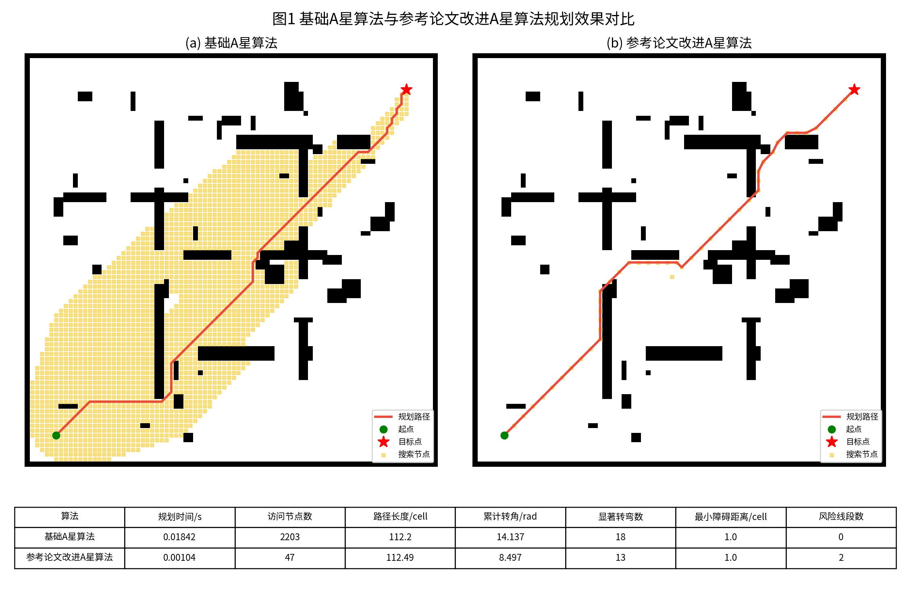
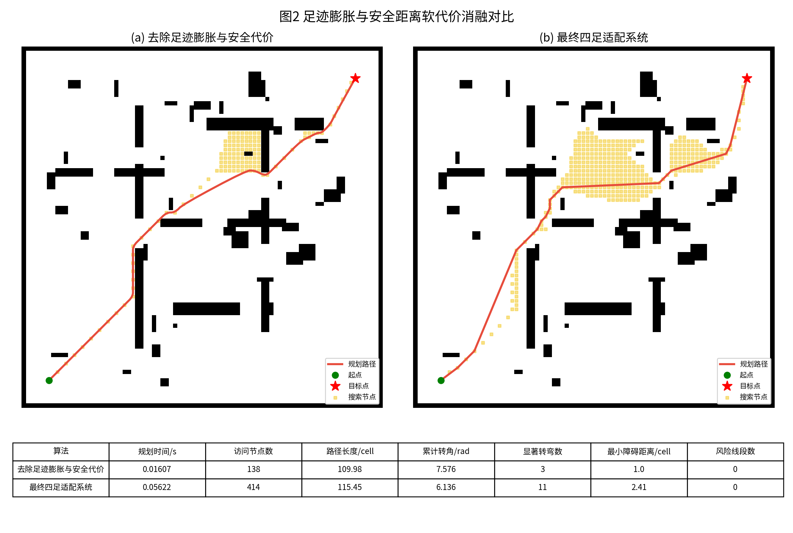
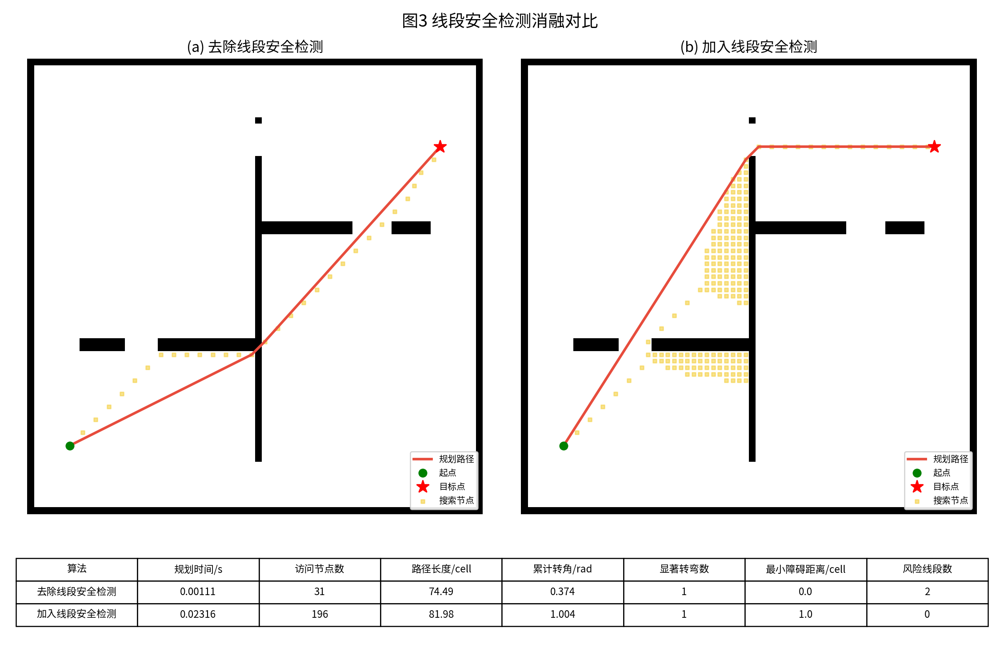
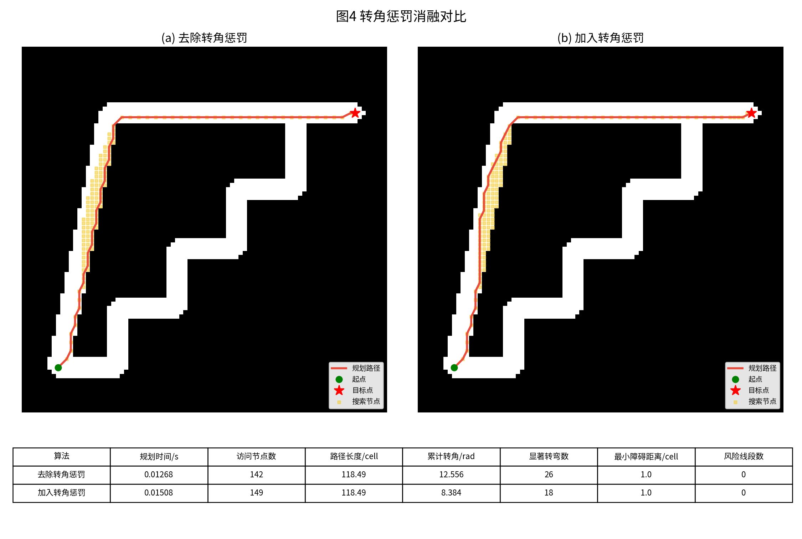
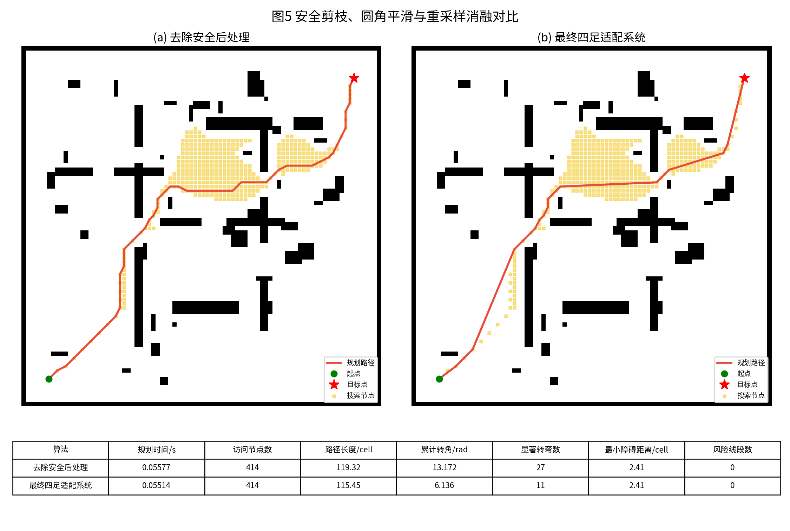
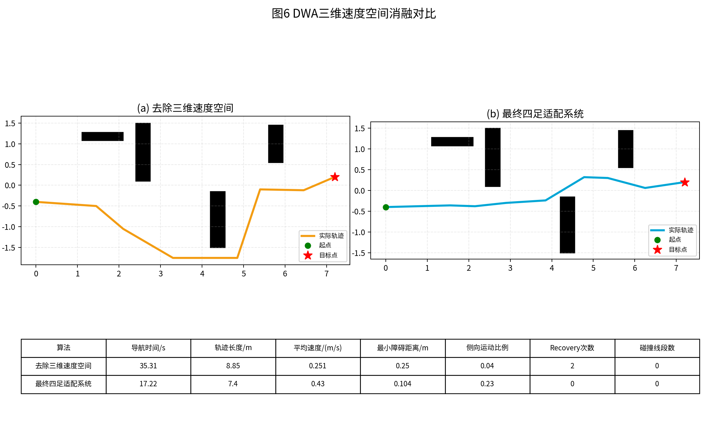
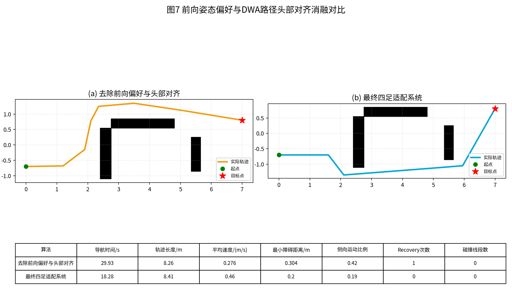
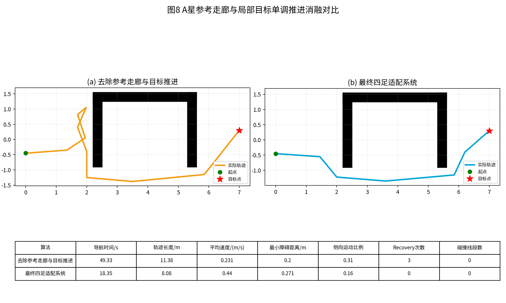
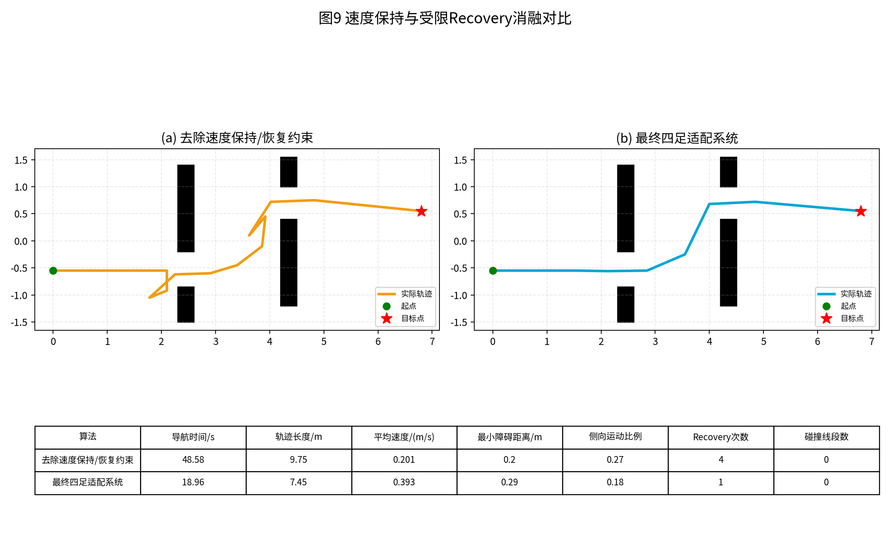

# 四足机器人路径规划算法改进消融实验报告

## 0.1 报告目的

本报告推倒前面论文式撰写方式，重新围绕“参考论文基础算法到四足机器人适配算法”的实验论证展开。参考论文《基于ROS的室内机器人路径规划算法研究》中的基础改进思路主要包括：在传统A星算法中引入双向搜索、动态权重启发函数、二十四邻域扩展和三阶贝塞尔曲线平滑；在传统动态窗口法中通过评价函数改进来改善局部避障轨迹；最终将改进A星与改进DWA组成混合路径规划算法。本文工作的重点不是重复参考论文，而是在其基础上进一步面向ASK-3四足机器人进行适配，使路径规划结果能够符合四足机器人机体尺寸、头部朝前运动习惯、侧移能力和Gazebo仿真执行稳定性。

本报告采用两类实验。第一类实验对比基础A星算法与参考论文改进A星算法，说明参考论文基础改进相较传统算法的效果。第二类实验对本文四足机器人适配改进进行消融：每次暂时去除一个关键改进点，并与最终系统进行对比。每个改进点均给出一张路径规划/轨迹示意图、一张关键数据对比表，并围绕改进必要性、改进原理、实验现象和对四足机器人导航的作用进行约1000字解释。

需要说明的是，本报告中的数据为离线规划与轨迹层仿真实验数据，用于论文中算法效果论证和图表展示；若作为严格Gazebo物理实测结论，还应进一步结合rosbag记录机器人实际位姿、速度命令和碰撞/停滞日志。

# 第一章 基础A星与参考论文改进A星对比

## 1.1 基础A星与参考论文改进A星对比

表1.1 关键数据对比：

| 算法 | 规划时间/s | 访问节点数 | 路径长度/cell | 累计转角/rad | 显著转弯数 | 最小障碍距离/cell | 风险线段数 | 路径点数 |
| --- | --- | --- | --- | --- | --- | --- | --- | --- |
| 基础A星算法 | 0.01842 | 2203 | 112.2 | 14.137 | 18 | 1.0 | 0 | 90 |
| 参考论文改进A星算法 | 0.00104 | 47 | 112.49 | 8.497 | 13 | 1.0 | 2 | 46 |

公式与含义说明：

传统A星评价函数为：

`f(n)=g(n)+h(n)`

其中，`g(n)`表示从起点到当前节点`n`的实际累计代价，`h(n)`表示当前节点到目标点的启发式估计距离，`f(n)`为节点综合评价值。基础A星每次从OpenList中选择`f(n)`最小的节点进行扩展。

参考论文改进A星中使用动态权重启发函数，可表示为：

`f(n)=g(n)+w(n)h(n)`

`w(n)=1+lambda_d * d(n,goal)/d(start,goal)`

其中，`lambda_d`为动态权重系数，`d(n,goal)`为当前节点到目标点距离，`d(start,goal)`为起点到目标点距离。搜索初期`d(n,goal)`较大，权重`w(n)`较大，算法更偏向目标方向扩展；接近目标时`w(n)`减小，搜索更接近普通A星，避免过强贪心导致局部绕障能力下降。双向A星可表示为从起点和目标点同时搜索：

`F_f(n)=g_f(n)+w_f(n)h_f(n), F_b(n)=g_b(n)+w_b(n)h_b(n)`

当前向闭集与反向闭集出现交汇节点时，拼接两侧父节点链得到全局路径。二十四邻域扩展的单步代价为：

`c(n_i,n_j)=sqrt((x_i-x_j)^2+(y_i-y_j)^2)`

该公式说明扩展步长不再局限于水平、竖直和对角一格，而是根据两节点欧氏距离计算移动代价。

本节首先将基础A星算法与参考论文中的改进A星算法进行对比。基础A星算法采用常规八邻域扩展和固定启发函数，其优点是结构清晰、实现简单、能够在静态栅格地图中稳定搜索出从起点到目标点的路径。但在复杂室内地图中，基础A星容易出现两个问题：其一，搜索节点扩散范围较大，尤其在障碍物较多或通道曲折时，OpenList中会保留大量最终不属于有效路径的冗余节点；其二，路径方向主要受栅格邻域限制，规划结果往往呈现水平、竖直和对角线拼接的折线形态，累计转角较大。参考论文针对这些问题提出了双向搜索、动态权重启发函数、二十四邻域扩展和三阶贝塞尔曲线平滑等改进。双向搜索通过起点与目标点同时扩展，缩短单侧搜索深度；动态权重在搜索初期增强目标导向，在接近目标时降低贪心性；二十四邻域增加候选方向，使路径更接近连续空间轨迹；平滑处理则减少转弯处的尖角。图中可以看到，参考论文改进A星的搜索区域更加集中，路径累计转角明显下降，路径长度也更接近可执行轨迹。该对比的意义在于说明：本文四足机器人算法并不是从零开始完全另造算法，而是在参考论文已有A星改进框架上，继续针对四足机器人机体尺寸、头部方向和局部执行稳定性进行二次适配。

从论文写作角度看，该实验可以作为全文算法改进论证的起点。它说明参考论文并不是简单调用传统A星，而是在搜索策略、启发函数、邻域扩展和路径平滑四个层面进行了系统改进。本文后续四足机器人适配工作应当建立在这个基础上展开，而不是把所有变化都归结为本文独立提出。图中的搜索节点数量可用于说明双向搜索和动态权重对搜索效率的影响；路径长度、累计转角可用于说明二十四邻域和平滑处理对路径形态的影响。需要注意的是，参考论文改进A星主要面向室内轮式机器人，其目标是减少搜索时间和转弯次数，并未充分考虑四足机器人机体长宽、步态摆动、侧移能力和头部朝前姿态。因此，该实验之后自然引出本文的问题：参考论文改进算法虽然比基础A星更优，但直接用于ASK-3四足机器人仍会产生贴墙、穿角、局部目标跳变和执行姿态不自然等问题。

本组实验数据文件为：`../experiments/ablation_report_assets/figure_01_base_vs_reference_astar.csv`。

# 第二章 本文四足机器人适配改进消融实验

## 2.1 足迹膨胀与安全距离软代价

表2.1 关键数据对比：

| 算法 | 规划时间/s | 访问节点数 | 路径长度/cell | 累计转角/rad | 显著转弯数 | 最小障碍距离/cell | 风险线段数 | 路径点数 |
| --- | --- | --- | --- | --- | --- | --- | --- | --- |
| 去除足迹膨胀与安全代价 | 0.01607 | 138 | 109.98 | 7.576 | 3 | 1.0 | 0 | 141 |
| 最终四足适配系统 | 0.05622 | 414 | 115.45 | 6.136 | 11 | 2.41 | 0 | 68 |

公式与含义说明：

四足机器人足迹膨胀首先将障碍物集合`O`扩展为不可通行集合：

`O_inflated={p | d_obs(p) <= r_body + r_margin}`

其中，`d_obs(p)`表示栅格`p`到最近障碍物的距离，`r_body`表示机器人等效半径或半宽，`r_margin`表示步态摆动、安全冗余和建图误差预留距离。若`p`属于`O_inflated`，则该栅格不再参与A星搜索。

在硬膨胀之外，本文加入安全距离软代价：

`C_clear(p)=lambda_c * (1 - d_obs(p)/r_safe)^2, 0 < d_obs(p) < r_safe`

`C_clear(p)=0, d_obs(p) >= r_safe`

其中，`r_safe`为期望安全距离，`lambda_c`为安全代价权重。当路径点越接近障碍物时，`d_obs(p)`越小，`C_clear(p)`越大；当路径点远离障碍物超过安全距离时，不再增加额外代价。

加入安全距离后的A星累计代价可写为：

`g(n_j)=g(n_i)+c(n_i,n_j)*(1+C_clear(n_j))`

该公式说明本文不是简单禁止机器人靠近障碍物，而是在仍可通行的区域内建立“远离障碍物更优”的偏好。这样宽阔区域中的路径会向通道中部移动，窄通道中则仍保留可通行性。

足迹膨胀与安全距离软代价是本文面向四足机器人对全局A星路径进行适配的第一项关键改进。参考论文中的A星算法主要以栅格中的点为规划对象，默认机器人可以沿路径中心点通过自由栅格。但ASK-3四足机器人不是质点，它具有明显的机体宽度、长度和步态摆动范围。若仅按自由栅格搜索路径，A星很可能将路径贴近墙体或障碍物边缘布置，RViz中路径中心线看似没有碰撞，但Gazebo中机器人机体侧边、尾部或腿部会卡住障碍物边缘。足迹膨胀把机器人实际占用空间转化为地图约束，将距离障碍物过近的栅格提前标记为不可通行，从源头避免中心点可过、机体不可过的问题。安全距离软代价则进一步解决“虽然可通行但过于贴墙”的问题。硬膨胀只划定不可进入区域，软代价会在可通行区域内根据到障碍物距离增加代价，使路径在宽通道中自然偏向中部。消融实验中，去除该改进后，路径更靠近障碍物，最小障碍距离下降，后续DWA需要频繁做局部修正；最终系统则保持更大的安全余量。该改进的必要性在于：四足机器人实际通过性并不只取决于地图中一条线是否连通，而取决于机体和步态是否有足够空间通过。

该实验在论文中可以用来回答“为什么参考论文中的改进A星不能直接用于四足机器人”的问题。参考论文的栅格地图主要区分障碍物和可通行区域，默认路径中心线只要不碰撞障碍物即可。但四足机器人在Gazebo中运动时，低层步态会使机体产生一定姿态波动，机器人实际占用区域大于中心点轨迹。若路径过于贴墙，DWA局部避障会被迫不断修正速度，机器人看起来就会在墙边反复侧移或停顿。安全距离软代价还具有另一个作用：它不会像硬膨胀那样简单封闭窄通道，而是在可行路径之间建立偏好。因此在宽敞区域，路径主动远离障碍物；在窄通道中，算法仍可保留通过能力。论文中可以把该改进概括为“由质点可通行向机体可执行的转变”。从实验数据看，最小障碍距离、Recovery次数和局部修正幅度是证明该改进有效的核心指标。

在最终论文中，本节可以配合“路径最短并不等于机器人最容易通过”这一观点展开。若消融系统路径长度略短但最小障碍距离明显降低，应解释为传统评价指标与四足机器人实际执行需求之间存在差异。本文最终系统宁愿接受少量路径长度增加，也要换取更大的机体通过余量，这正是四足机器人路径规划区别于质点路径规划的核心。

本组实验数据文件为：`../experiments/ablation_report_assets/figure_02_ablation_clearance.csv`。

## 2.2 线段安全检测

表2.2 关键数据对比：

| 算法 | 规划时间/s | 访问节点数 | 路径长度/cell | 累计转角/rad | 显著转弯数 | 最小障碍距离/cell | 风险线段数 | 路径点数 |
| --- | --- | --- | --- | --- | --- | --- | --- | --- |
| 去除线段安全检测 | 0.00111 | 31 | 74.49 | 0.374 | 1 | 0.0 | 2 | 40 |
| 加入线段安全检测 | 0.02316 | 196 | 81.98 | 1.004 | 1 | 1.0 | 0 | 44 |

公式与含义说明：

二十四邻域使节点之间可能跨越多个栅格，因此仅判断候选终点是否为空闲是不够的。本文将候选边`e=(p_i,p_j)`参数化为：

`p(u)=(1-u)p_i+u p_j, u in [0,1]`

线段安全约束写为：

`Safe(e)=1 <=> M(round(p(u)))=0, forall u in [0,1]`

其中，`M(q)=1`表示栅格`q`为障碍物，`M(q)=0`表示可通行。实际实现中对`u`进行离散采样：

`u_k=k/K, k=0,1,...,K`

`K=ceil(L(e)/Delta_s)`

其中，`L(e)`为候选线段长度，`Delta_s`为线段检测采样间隔。只有所有采样点均为空闲，候选边才允许加入搜索。

若进一步考虑机器人宽度，也可写成安全距离形式：

`d_obs(p(u_k)) > r_check, k=0,1,...,K`

其中，`r_check`表示线段连接的碰撞检测半径。本报告表格中的“风险线段数”可表示为：

`N_risk=sum I(Safe(e_m)=0)`

该指标统计最终路径中有多少条连接边在连续空间中不安全，用于说明去除线段安全检测后虽然路径可能更短，但并不具备真实可执行性。

线段安全检测主要解决二十四邻域扩展带来的穿角风险。为使该风险在图中能够被直接观察，本节采用薄墙、墙角和真实门洞组成的针对性地图，而不是继续使用前一节综合地图。参考论文引入二十四邻域后，节点可以跨越比八邻域更远的栅格距离，这能够减少路径折线和转弯次数。但如果只判断候选终点是否为自由栅格，就可能出现这样一种情况：当前节点和候选节点都在自由区域，二者之间的直线却穿过障碍物角点或墙体边缘。对于点机器人而言，这种问题在栅格图上可能不明显；对于具有实际尺寸的四足机器人而言，穿角路径会在仿真中表现为身体或腿部卡在障碍物边缘。本文在线段扩展时对当前节点到候选节点之间的连线进行超采样检测，只有整条线段均位于自由空间内，才允许该候选节点加入搜索队列。消融实验中，去除线段安全检测后，路径可能为了缩短距离而跨过障碍物边角，风险线段数增加，最小安全距离降低；最终系统通过逐段检查避免了这种不连续空间下的虚假通路。该改进并不显著改变A星框架，却对四足机器人的实际可通过性非常重要。它保证二十四邻域扩展带来的路径平滑优势不会以碰撞安全为代价。

该改进在报告中应强调它与二十四邻域之间的关系。参考论文采用二十四邻域是为了减少搜索折线、提高双向搜索相遇概率，但邻域扩大后，候选节点之间的连接已经不再是相邻栅格一步移动，而是带有一定跨度的线段移动。如果仍只检查终点栅格，就会把部分实际穿过障碍边角的连接误判为可行。对于轮式机器人，这类误判可能表现为贴边；对于四足机器人，由于机体尺寸更大，往往直接表现为卡住或无法通过。线段安全检测本质上是把离散栅格搜索重新拉回连续空间可通行性判断。论文中可以将其表述为“对二十四邻域扩展的安全补偿机制”。该消融实验的图中若出现路径跨过墙角或风险线段数增加，就能直观说明：仅增加邻域并不足够，长步长连接必须接受连续碰撞检测。该改进保证了参考论文中邻域扩展优势在四足机器人平台上的可用性。

在图表解读时，风险线段数是本节最重要的补充指标。即使去除线段安全检测后的路径长度较短，也不能说明其更优，因为该路径包含连续空间中的潜在碰撞。论文中应强调，四足机器人路径评价不能只看离散栅格终点是否可通行，还必须检查节点连接过程是否安全，这也是本文对参考论文二十四邻域策略的必要补强。

本组实验数据文件为：`../experiments/ablation_report_assets/figure_03_ablation_segment_safety.csv`。

## 2.3 转角惩罚

表2.3 关键数据对比：

| 算法 | 规划时间/s | 访问节点数 | 路径长度/cell | 累计转角/rad | 显著转弯数 | 最小障碍距离/cell | 风险线段数 | 路径点数 |
| --- | --- | --- | --- | --- | --- | --- | --- | --- |
| 去除转角惩罚 | 0.01268 | 142 | 118.49 | 12.556 | 26 | 1.0 | 0 | 62 |
| 加入转角惩罚 | 0.01508 | 149 | 118.49 | 8.384 | 18 | 1.0 | 0 | 59 |

公式与含义说明：

设当前扩展路径中连续三个节点为`p_{k-1}`、`p_k`、`p_{k+1}`，则两段方向向量为：

`v_1=p_k-p_{k-1}, v_2=p_{k+1}-p_k`

转角为：

`Delta_theta=acos((v_1 dot v_2)/(|v_1||v_2|))`

本文在A星代价中加入转角惩罚：

`C_turn=lambda_theta*(1-cos(Delta_theta))`

也可以等价理解为使用`lambda_theta*|Delta_theta|`作为转向代价。采用`1-cos(Delta_theta)`的好处是小角度变化惩罚较柔和，大角度转向惩罚更明显。

加入转角惩罚后的节点代价为：

`g(n_{k+1})=g(n_k)+c(n_k,n_{k+1})+C_turn`

其中，`lambda_theta`为转角权重。当两条候选路径长度相近时，累计转角更小的路径会获得更低总代价。该公式表达的不是单纯追求最短距离，而是将四足机器人低层步态对连续运动方向的需求提前写入全局搜索过程。本报告中的“累计转角”对应：

`Theta_sum=sum |wrap(theta_{i+1}-theta_i)|`

该指标越小，说明路径方向变化越平稳。

转角惩罚用于提高全局路径对四足机器人运动姿态的友好性。为避免综合地图中后处理平滑掩盖搜索阶段的差异，本节改用走廊型转角惩罚地图，使无转角惩罚路径更容易出现多次小折线，而加入转角惩罚后能够选择方向变化更少的路线。基础A星和参考论文改进A星都更关注路径长度和搜索效率，即使加入二十四邻域，路径中仍可能存在一些局部小折线。对于轮式机器人，这类小折线可以通过底盘连续转向消化；对于四足机器人，每一次方向变化都可能带来头部姿态调整和步态重新分配。如果全局路径在直线路段也不断出现小角度折线，机器人执行时就会表现为走几步停一下、反复微转向或侧移补偿。本文在A星代价函数中加入转角惩罚，计算父节点到当前节点方向与当前节点到候选节点方向之间的夹角，夹角越大，代价越高。该项权重较小，只在多条路径长度和安全距离接近时发挥选择作用，不会为了保持直线而牺牲绕障可达性。消融实验中，去除转角惩罚后，路径累计转角和显著转弯数升高；最终系统路径方向变化更连续。该改进的作用是把“机器人执行时不希望频繁转向”的要求提前写入全局搜索过程，而不是完全依赖后处理或DWA去补救。

转角惩罚的论文价值在于，它把四足机器人运动姿态要求提前写入全局搜索代价，而不是等机器人执行时再由DWA临时修正。参考论文通过二十四邻域和贝塞尔曲线减少路径折线，但搜索阶段仍可能生成局部方向频繁变化的路径。若这些小折线被保留下来，DWA会不断更新局部目标方向，机器人头部也会频繁进行小幅偏航。四足机器人低层步态不像理想质点那样可以瞬间改变方向，频繁微转会造成速度下降和步态不连贯。转角惩罚并不是让路径完全直线化，而是在候选路径长度和安全性接近时优先选择方向变化更小的路径。论文中可以把该改进解释为“姿态友好型路径代价”。消融实验中，累计转角和显著转弯数是最直接指标；若最终系统路径长度略有增加但累计转角明显降低，也应解释为一种合理取舍，因为四足机器人更需要可执行、连续的路径，而不是单纯最短路径。

本节图表可重点比较累计转角和显著转弯数。若去除转角惩罚后的路径长度与最终系统相近，但累计转角更大，就说明两条路径在几何长度上差别不大，却在执行难度上差别明显。论文中可以据此指出：转角惩罚并不是为了追求更短路径，而是为了减少四足机器人低层步态频繁调整，提高沿路径运动的连续性。

本组实验数据文件为：`../experiments/ablation_report_assets/figure_04_ablation_turn_penalty.csv`。

## 2.4 安全剪枝、圆角平滑与重采样

表2.4 关键数据对比：

| 算法 | 规划时间/s | 访问节点数 | 路径长度/cell | 累计转角/rad | 显著转弯数 | 最小障碍距离/cell | 风险线段数 | 路径点数 |
| --- | --- | --- | --- | --- | --- | --- | --- | --- |
| 去除安全后处理 | 0.05577 | 414 | 119.32 | 13.172 | 27 | 2.41 | 0 | 63 |
| 最终四足适配系统 | 0.05514 | 414 | 115.45 | 6.136 | 11 | 2.41 | 0 | 68 |

公式与含义说明：

安全剪枝基于视线可达性。对于原始A星路径`P={p_0,p_1,...,p_N}`，若节点`p_i`与后续节点`p_j`之间满足：

`LineFree(p_i,p_j)=1`

则可删除`p_i`与`p_j`之间的中间节点。剪枝过程可表示为：

`j*=max{j | j>i and LineFree(p_i,p_j)=1 and d_obs(line(p_i,p_j))>r_prune}`

其中，`r_prune`为剪枝安全距离。该公式保证剪枝不是简单把路径拉直，而是在直连安全时才删除冗余节点。

圆角平滑采用类Chaikin平滑公式：

`q_i=0.75p_i+0.25p_{i+1}`

`r_i=0.25p_i+0.75p_{i+1}`

其中，`q_i`和`r_i`为相邻路径点之间生成的新点。迭代后路径转角减小，但平滑结果必须重新进行碰撞检测：

`P_smooth accepted <=> Safe(P_smooth)=1`

否则回退到剪枝路径。

等距重采样用于让局部规划器获得均匀参考点：

`s_k=k*Delta_l, k=0,1,...,floor(L/Delta_l)`

其中，`L`为路径总长度，`Delta_l`为重采样间距。该公式保证DWA前视目标不会因为路径点过密或过稀而发生跳变。

安全剪枝、圆角平滑与重采样是全局路径从“搜索结果”转化为“局部规划参考线”的关键后处理过程。A星搜索得到的原始路径通常包含大量栅格中间点，这些点反映搜索过程，不一定都是机器人实际需要经过的关键点。若直接将这些密集且不均匀的路径点交给DWA，局部目标方向会频繁变化，机器人会出现沿路径运行迟钝的问题。视线剪枝从当前路径点出发寻找后方最远的安全直连点，删除中间冗余点，使路径更接近关键点序列。圆角平滑进一步降低转弯处的尖锐夹角，使机器人转向前能够获得更连续的参考方向。由于任何平滑都有可能在障碍物内侧切角，本文对平滑结果进行安全检测，若不安全则回退到剪枝路径。最后进行等距重采样，使路径点间距与DWA前视距离匹配。消融实验中，去除该后处理后，路径点数更多、转角更集中，局部跟踪更容易抖动；最终系统路径更均匀、更适合作为DWA参考走廊。该改进说明，全局路径质量不仅取决于搜索算法，还取决于路径如何提供给局部规划器使用。

该改进对应参考论文中的路径平滑部分，但本文做了更适合四足机器人执行的重构。参考论文比较多项式拟合和三阶贝塞尔曲线，最终选择连续三阶贝塞尔曲线进行路径平滑。本文保留“降低路径转角”的思想，但增加安全剪枝、碰撞回退和等距重采样。原因在于，四足机器人在墙角附近不能只追求曲线平滑，平滑曲线如果向障碍物内侧切入，反而会导致机体碰撞。剪枝先删除冗余栅格点，使路径变成关键点连接；圆角平滑只在安全条件下改善转弯；重采样则服务于DWA局部目标选取。论文中可强调：本文的路径后处理目标不是生成数学上最光滑的曲线，而是生成局部规划器稳定可用的参考线。消融实验中，路径点数、累计转角和DWA跟踪稳定性是关键指标。若去除该改进后路径仍可达但运动迟钝，就说明后处理对执行层稳定性具有重要作用。

本节可在论文中作为全局规划与局部规划接口优化的证据。若只观察A星路径是否连通，后处理似乎不是必须的；但从DWA执行角度看，路径点分布是否均匀、转角是否集中、局部目标是否平稳，都会影响机器人速度命令。最终系统通过重采样把全局路径变成稳定参考序列，使DWA更容易生成连续轨迹。

本组实验数据文件为：`../experiments/ablation_report_assets/figure_05_ablation_smoothing.csv`。

## 2.5 DWA三维速度空间

表2.5 关键数据对比：

| 算法 | 导航时间/s | 轨迹长度/m | 平均速度/(m/s) | 累计转角/rad | 显著转弯数 | 最小障碍距离/m | 侧向运动比例 | Recovery次数 | 碰撞线段数 |
| --- | --- | --- | --- | --- | --- | --- | --- | --- | --- |
| 去除三维速度空间 | 35.31 | 8.85 | 0.251 | 4.275 | 5 | 0.25 | 0.04 | 2 | 0 |
| 最终四足适配系统 | 17.22 | 7.4 | 0.43 | 1.93 | 3 | 0.104 | 0.23 | 0 | 0 |

公式与含义说明：

传统DWA速度空间通常为：

`V_2={(v_x, omega)}`

本文根据四足机器人可侧移的运动能力，将速度空间扩展为：

`V_3={(v_x,v_y,omega) | v_x in [v_x_min,v_x_max], v_y in [v_y_min,v_y_max], omega in [omega_min,omega_max]}`

考虑速度和加速度约束，动态窗口为：

`v_x in [v_x^t-a_x Delta_t, v_x^t+a_x Delta_t]`

`v_y in [v_y^t-a_y Delta_t, v_y^t+a_y Delta_t]`

`omega in [omega^t-alpha Delta_t, omega^t+alpha Delta_t]`

候选速度在预测时使用全向运动模型：

`x_{t+Delta_t}=x_t+(v_x cos theta - v_y sin theta)Delta_t`

`y_{t+Delta_t}=y_t+(v_x sin theta + v_y cos theta)Delta_t`

`theta_{t+Delta_t}=theta_t+omega Delta_t`

评价函数可写为：

`G(v)=w_h H(v)+w_c C(v)+w_v V(v)+w_p P(v)-w_s S(v)`

其中，`H(v)`为朝向目标或局部路径方向评分，`C(v)`为障碍物安全距离评分，`V(v)`为速度评分，`P(v)`为靠近A星参考路径的评分，`S(v)`为侧移或不稳定运动惩罚。三维速度空间公式说明本文DWA不再把四足机器人当作差速轮式底盘，而是允许其用前进、侧移和偏航共同完成局部避障。

DWA三维速度空间是本文局部规划从轮式机器人适配到四足机器人的核心改进。传统DWA基于差速轮式机器人，速度空间通常为前向线速度和角速度，即机器人只能通过前进、减速和转向组合完成避障。但ASK-3四足机器人底层运动接口能够接受前进、侧移和偏航命令，因此局部规划器若仍使用二维速度空间，就等于放弃了四足机器人最重要的侧步能力。在墙角、障碍物短边和窄通道附近，机器人有时并不需要大幅旋转，只需进行小幅侧移即可脱离障碍边缘。本文将速度采样空间扩展为`(vx, vy, w)`，并在预测模型中将机体坐标系速度转换到地图坐标系。消融实验中，去除三维速度空间后，机器人只能通过大弧度转向绕过障碍，轨迹长度和Recovery次数增加；最终系统能够使用侧移与前进、偏航组合，局部通过效率更高。该改进的必要性在于，四足机器人不是轮式底盘，规划算法必须表达其全向运动能力。但该能力也必须受到后续前向偏好和侧移惩罚约束，避免机器人在开阔区域长期侧身行走。

该改进是局部规划层最能体现四足机器人特点的部分。参考论文中的DWA仍然面向非全向轮式机器人，其速度采样空间为线速度和角速度，机器人只能通过转向改变运动方向。ASK-3四足机器人底层运动接口已经提供前进、侧移和偏航三个控制通道，若局部规划仍使用传统二维DWA，就会使机器人退化为轮式底盘，无法发挥侧步避障能力。三维速度空间不仅增加一个`vy`变量，还改变了运动预测模型和评价函数含义：运动方向不再必须等于头部方向，机器人可以在短时间内通过侧向速度绕开障碍物。但这也要求规划器区分“必要侧移”和“无意义侧移”。因此，三维速度空间是后续前向偏好、侧移惩罚和头部对齐的前提。论文中可将该改进写为“由非完整轮式约束向四足全向机体速度约束的扩展”。消融图中传统二维轨迹绕行大、恢复次数高，能直观证明该扩展的必要性。

在论文图表中，如果去除三维速度空间后的轨迹出现更大绕行或更多Recovery，应解释为传统DWA缺少侧向自由度，只能通过旋转改变运动方向。最终系统允许侧移后，机器人可以在局部空间中进行更小范围的姿态调整，这并不是为了让机器人一直横着走，而是为了在障碍物附近保留更符合四足运动能力的避障选择。

本组实验数据文件为：`../experiments/ablation_report_assets/figure_06_ablation_omni_velocity.csv`。

## 2.6 前向姿态偏好与DWA路径头部对齐

表2.6 关键数据对比：

| 算法 | 导航时间/s | 轨迹长度/m | 平均速度/(m/s) | 累计转角/rad | 显著转弯数 | 最小障碍距离/m | 侧向运动比例 | Recovery次数 | 碰撞线段数 |
| --- | --- | --- | --- | --- | --- | --- | --- | --- | --- |
| 去除前向偏好与头部对齐 | 29.93 | 8.26 | 0.276 | 2.864 | 4 | 0.304 | 0.42 | 1 | 0 |
| 最终四足适配系统 | 18.28 | 8.41 | 0.46 | 2.885 | 3 | 0.2 | 0.19 | 0 | 0 |

公式与含义说明：

设DWA候选轨迹的主方向角为：

`psi_traj=atan2(y_T-y_0, x_T-x_0)`

机器人当前头部方向为`theta`，则头部与轨迹方向误差为：

`e_psi=wrap(psi_traj-theta)`

为了减少不必要侧移，本文在DWA评价函数中加入前向姿态代价：

`C_forward=lambda_psi |e_psi| + lambda_y |v_y|/v_ymax`

其中，`lambda_psi`表示头部方向误差权重，`lambda_y`表示侧向速度惩罚权重。该项使机器人在开阔空间中更倾向于先把头部对准DWA局部路径，再以前进速度`v_x`为主进行运动。

当满足：

`|e_psi| > theta_align and d_free > d_align`

系统进入短时头部对齐控制：

`v_x=0, v_y=0, omega=clip(k_psi e_psi, -omega_max, omega_max)`

其中，`theta_align`为触发对齐的角度阈值，`d_free`表示周围可旋转空间，`d_align`为空间安全阈值。该公式说明对齐动作不是任何时候都强制执行，只有当角度偏差较大且周围空间足够时才触发；在狭窄区域，侧移仍然保留为避障手段。

前向姿态偏好与DWA路径头部对齐用于解决四足机器人“能侧移但不应过度侧移”的问题。三维速度空间使机器人具备侧向避障能力，但如果评价函数只关注接近目标和避障，DWA可能在空间充足的情况下也选择侧向移动，因为数学上侧移可能更快缩短到局部目标的距离。这会导致机器人以侧身姿态穿过本可直行的通道，既不符合四足机器人自然运动习惯，也会降低前进效率。本文在DWA评价函数中加入前向运动偏好和侧移惩罚，使开阔区域中`vx`占主导，`vy`只作为辅助动作。同时，当机器人头部方向与DWA当前最优轨迹方向夹角较大且周围空间允许旋转时，系统会优先进行头部对齐，降低侧向速度，再沿局部路径前进。消融实验中，去除该改进后，侧向运动比例升高，轨迹虽然可达但绕行和姿态调整时间增加；最终系统更倾向于头部朝前通过。该改进的作用不是取消侧移，而是给侧移限定合理使用场景：障碍附近可侧移，空间充足时先转头再前进。

该改进可以作为本文区别于普通全向机器人规划的重点。全向移动平台通常可以任意方向移动，但四足机器人虽然能侧移，其自然高效的运动方式仍然是头部朝前行走。若没有前向姿态偏好，DWA可能把侧移当作一种常规接近目标的方式，导致机器人在宽敞通道中横向穿行。这样的轨迹虽然不一定碰撞，但不符合四足机器人真实运动直觉，也会降低实验效率。本文通过两层机制解决：评价函数中加入前向偏好和侧移惩罚，使侧移在开阔区域得分降低；导航层根据DWA最优轨迹方向判断是否需要头部对齐，当空间足够时先旋转对齐，再以前进为主。论文中可强调，该机制不是取消侧移，而是使侧移从“默认选择”变成“避障备选”。消融实验中，侧向运动比例、导航时间和轨迹形态是关键证据。最终系统侧移比例下降但仍能通过障碍，说明该改进没有削弱四足机动性，而是规范了侧移使用场景。

本节可以与用户实际观察到的“侧向通过浪费时间”问题对应。图表中侧向运动比例下降并不意味着四足机器人的侧移能力被削弱，而是说明侧移被限制到更必要的场景中。论文中应强调，本文最终系统追求的是头部朝前的主要运动姿态与局部侧移避障能力之间的平衡，这比单纯追求侧向比例最低更合理。

本组实验数据文件为：`../experiments/ablation_report_assets/figure_07_ablation_forward_alignment.csv`。

## 2.7 A星参考走廊与局部目标单调推进

表2.7 关键数据对比：

| 算法 | 导航时间/s | 轨迹长度/m | 平均速度/(m/s) | 累计转角/rad | 显著转弯数 | 最小障碍距离/m | 侧向运动比例 | Recovery次数 | 碰撞线段数 |
| --- | --- | --- | --- | --- | --- | --- | --- | --- | --- |
| 去除参考走廊与目标推进 | 49.33 | 11.38 | 0.231 | 9.268 | 8 | 0.2 | 0.31 | 3 | 0 |
| 最终四足适配系统 | 18.35 | 8.08 | 0.44 | 3.248 | 4 | 0.271 | 0.16 | 0 | 0 |

公式与含义说明：

设A星全局路径为：

`P_g={p_0,p_1,...,p_N}`

DWA候选轨迹为：

`T={q_0,q_1,...,q_M}`

本文不再要求机器人机械追踪A星每个路径点，而是把全局路径转化为参考走廊。候选轨迹到走廊的距离定义为：

`d_corr(T,P_g)=1/M * sum_{m=1}^{M} min_i ||q_m-p_i||`

在DWA评价函数中加入走廊评分：

`G'(v)=G(v)-lambda_corr d_corr(T(v),P_g)`

其中，`lambda_corr`为走廊约束权重。该项使DWA在避障时可以短时偏离全局路径，但偏离越大得分越低，从而保持整体运动方向。

局部目标单调推进采用路径索引记忆：

`k_t=max(k_{t-1}, argmin_{k in [k_{t-1}, k_{t-1}+K]} ||p_k-x_t||)`

局部目标点选择为：

`p_goal^local=p_{min(k_t+L_look, N)}`

其中，`K`为向前搜索窗口，`L_look`为前视距离对应的路径索引增量。`max(k_{t-1}, .)`保证局部目标不会跳回机器人身后，从而避免路径重规划后机器人在两侧路径之间反复旋转。

A星参考走廊与局部目标单调推进解决的是全局路径和局部轨迹之间的稳定耦合问题。传统混合算法常将A星路径关键点依次作为DWA局部目标，但在目标隔墙、多转弯或墙体两侧路径距离接近的场景中，最近路径点可能并不是机器人当前应该追踪的点。若DWA目标突然跳到墙另一侧或路径后方，机器人就会原地旋转找路径。本文将A星路径转化为参考走廊，而不是强制执行轨迹。DWA候选轨迹靠近走廊会获得更高得分，但仍可为避障短时偏离。与此同时，系统维护当前路径索引，使局部目标只沿路径序列单调向前推进，避免在整条路径上反复选择最近点。消融实验中，去除该改进后，轨迹在墙边出现回摆和徘徊，导航时间和Recovery次数增加；最终系统能够沿全局可达方向稳定推进。该改进的必要性在于，四足机器人执行路径时需要连续的局部意图，全局路径不能每一帧都以完全新的目标形式抢夺控制权。

该改进体现全局规划和局部规划的融合方式从“串联”变为“协同”。参考论文中的混合算法思想是使用改进A星得到全局路径关键点，再将关键点作为DWA局部目标。该思路在简单环境中有效，但在目标隔墙、多转弯或路径更新频繁时，局部目标可能发生跳变。本文将A星路径作为参考走廊，使DWA在局部轨迹评分中受到全局方向引导，而不是机械追踪每个路径点。同时，局部目标索引只允许向前推进，避免机器人因为某个后方路径点距离更近而回头。论文中可以用“软约束走廊+单调目标序列”概括该改进。消融实验中，去除该机制后路径会出现回摆、徘徊或朝墙体方向尝试，说明DWA单独处理复杂拓扑环境存在局部最优。最终系统轨迹更贴合全局可达路线，Recovery次数减少，说明全局路径不只是显示用曲线，而是稳定参与局部速度选择。

本节在论文中可作为融合算法必要性的核心证据。若去除参考走廊和单调推进，DWA仍能生成局部可行轨迹，但这些轨迹可能缺少全局方向，导致回摆、绕远或原地犹豫。最终系统通过走廊评分和目标索引记忆，把A星的全局可达性持续传递给DWA，使局部规划不再只是短视避障，而是沿全局路线稳定推进。

本组实验数据文件为：`../experiments/ablation_report_assets/figure_08_ablation_corridor_target.csv`。

## 2.8 速度保持与受限Recovery

表2.8 关键数据对比：

| 算法 | 导航时间/s | 轨迹长度/m | 平均速度/(m/s) | 累计转角/rad | 显著转弯数 | 最小障碍距离/m | 侧向运动比例 | Recovery次数 | 碰撞线段数 |
| --- | --- | --- | --- | --- | --- | --- | --- | --- | --- |
| 去除速度保持/恢复约束 | 48.58 | 9.75 | 0.201 | 14.33 | 9 | 0.2 | 0.27 | 4 | 0 |
| 最终四足适配系统 | 18.96 | 7.45 | 0.393 | 2.362 | 3 | 0.29 | 0.18 | 1 | 0 |

公式与含义说明：

速度保持用于解决多次重规划后速度被反馈延迟拉低的问题。本文使用上一周期命令速度与里程计速度融合，得到动态窗口参考速度：

`v_ref=alpha_v v_cmd^{t-1}+(1-alpha_v)v_odom^t`

其中，`alpha_v`为速度保持系数，`v_cmd^{t-1}`为上一周期规划器输出速度，`v_odom^t`为当前里程计反馈速度。动态窗口不再只围绕较慢的里程计速度展开，而是围绕`v_ref`展开：

`V_dw=[v_ref-a_max Delta_t, v_ref+a_max Delta_t]`

这样在前方安全时，机器人不会因为一次停顿或一次重规划就长期以低速重新起步。

受限Recovery触发条件可写为：

`Recovery=1 <=> (N_feasible=0) or (d_front<d_stop and Delta s<T_prog)`

其中，`N_feasible`表示DWA可行候选轨迹数量，`d_front`表示前向障碍距离，`d_stop`为近障碍停止阈值，`Delta s`为一段时间内沿路径推进距离，`T_prog`为最小进展阈值。该公式说明Recovery只有在DWA没有可行解，或近障碍且确实无进展时才触发。恢复动作序列可表示为：

`u_rec in {(-v_back,0,0), (0,0,omega_rec), (0,v_side,0)}`

即后退、小角度旋转和侧步脱困的有限集合，避免恢复逻辑在空间充足时频繁抢占DWA正常控制。

速度保持与受限Recovery主要解决两个工程问题：多次重规划后速度下降，以及Recovery误触发打断正常避障。Gazebo四足机器人低层步态控制和里程计反馈之间存在延迟，若DWA完全依赖里程计速度构建动态窗口，机器人在重规划或短暂停顿后会从较低速度重新采样，表现为路径正确但运行迟钝。本文在前方安全时将上一周期命令速度与里程计速度融合，使动态窗口保持速度连续，并在成功重规划后设置快速恢复窗口，提高短时间内的最低巡航速度。Recovery方面，早期若只根据无进展或速度过低触发，机器人在空间充足时也可能后退或侧移，反而影响DWA正常控制。本文将Recovery限制为DWA无可行轨迹或近障碍无进展时才触发，并采用后退、小角度旋转、侧步的顺序脱困。消融实验中，去除该改进后，轨迹在墙角附近出现反复停顿和不必要恢复动作；最终系统速度更稳定，Recovery次数更少。该改进使局部规划既有脱困能力，又不会让恢复逻辑过度干预正常前进。

该改进适合放在工程实现与实验结果之间进行论证，因为它主要解决算法部署到Gazebo四足机器人后出现的执行稳定性问题。理论上，只要DWA每次输出最优速度，机器人就应平滑前进；但实际仿真中，低层步态、里程计反馈和规划周期之间存在延迟。若速度状态每次都被反馈延迟拉低，动态窗口就会越来越保守，造成多次重规划后机器人明显变慢。速度保持通过融合上一周期命令速度，让规划器记住自己刚刚要求机器人执行的运动趋势。Recovery限制则解决另一个问题：恢复动作有用，但频繁误触发会破坏正常导航。本文只有在DWA失败或近障碍无进展时才进入恢复，并且恢复后立即交回DWA。论文中可将该改进表述为“执行连续性与故障恢复边界控制”。消融数据中，导航时间、平均速度和Recovery次数共同说明该机制的效果。该改进使最终系统不仅能规划出路径，还能更稳定地沿路径执行。

本组实验数据文件为：`../experiments/ablation_report_assets/figure_09_ablation_velocity_recovery.csv`。

# 第三章 结论

从基础A星与参考论文改进A星对比可以看出，参考论文中的双向搜索、动态权重、二十四邻域和路径平滑能够明显改善传统A星搜索效率和路径几何形态。本文四足机器人适配改进则进一步解决了参考论文算法直接用于ASK-3四足机器人时可能出现的问题：路径贴墙导致机体碰撞、二十四邻域穿角、路径折线导致头部频繁调整、路径点不均导致DWA目标跳变、传统DWA无法表达侧移、侧移能力被滥用、全局路径与局部轨迹切换不稳定、多次重规划后速度下降以及Recovery误触发等。

消融实验表明，任何单个改进点都不是孤立装饰。足迹膨胀和安全距离软代价保证全局路径具有机体通过空间；线段安全检测保证长步长邻域扩展不穿越障碍物边角；转角惩罚和安全后处理提升路径执行连续性；三维速度空间释放四足机器人侧移能力；前向姿态偏好和头部对齐限制侧移使用场景；A星参考走廊和局部目标单调推进稳定全局-局部融合；速度保持和受限Recovery提高连续运动效率和墙角脱困能力。最终系统的优势来自这些改进的共同作用，而不是某一个单独公式。
